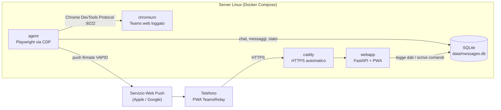

# TeamsRelay

**Microsoft Teams sul telefono anche quando le app native sono bloccate.**
TeamsRelay è una web app self-hosted (installabile come app sull'iPhone) che ti fa leggere e rispondere alle chat di Teams, con notifiche push, passando da un browser remoto su un tuo server.

> ⚠️ **Avvertenze** — Usa TeamsRelay solo con il **tuo** account e nel rispetto delle policy della tua organizzazione: automatizza una sessione web di Teams a tuo nome. Il progetto non è affiliato né approvato da Microsoft; "Microsoft Teams" è un marchio di Microsoft. Nessuna garanzia: se Microsoft cambia l'interfaccia web di Teams, alcune funzioni possono smettere di funzionare finché i selettori non vengono aggiornati.

---

## Indice

1. [Perché esiste](#perché-esiste)
2. [Cosa fa](#cosa-fa)
3. [Come funziona](#come-funziona)
4. [Limiti noti](#limiti-noti)
5. [Requisiti](#requisiti)
6. [Installazione passo-passo](#installazione-passo-passo)
7. [Configurazione (.env)](#configurazione-env)
8. [Installare l'app sul telefono](#installare-lapp-sul-telefono)
9. [Uso quotidiano](#uso-quotidiano)
10. [Desktop remoto](#desktop-remoto)
11. [Opzionale: condividere la porta 443 con OpenVPN (sslh)](#opzionale-condividere-la-porta-443-con-openvpn-sslh)
12. [Deploy automatico (GitHub Actions)](#deploy-automatico-github-actions)
13. [Manutenzione e risoluzione problemi](#manutenzione-e-risoluzione-problemi)
14. [Riferimento API](#riferimento-api)
15. [Dettagli tecnici](#dettagli-tecnici)
16. [Struttura del progetto](#struttura-del-progetto)
17. [Sicurezza](#sicurezza)
18. [Appendice A — Inoltrare le email con Power Automate](#appendice-a--inoltrare-le-email-con-power-automate)
19. [Appendice B — Copiare le riunioni su un altro calendario](#appendice-b--copiare-le-riunioni-su-un-altro-calendario)
20. [Licenza](#licenza)

---

## Perché esiste

Alcuni account Microsoft 365 (per licenza o per regole di *conditional access*) possono usare Teams **solo dal browser del PC**: le app Teams per Windows e iPhone sono bloccate, e la versione web di Teams sul telefono non funziona. Risultato: niente notifiche e niente chat quando sei lontano dal PC.

TeamsRelay risolve così: un Chromium in un container sul tuo server tiene aperto **Teams web** con il tuo account. Un agent lo legge e lo comanda come faresti tu con mouse e tastiera, e una web app mobile ti mostra le chat e ti manda le notifiche push sul telefono.

## Cosa fa

- **Chat stile Teams mobile**: avatar, nome, anteprima, orario, pallino dei non letti, contatore sul tab. La chat con te stesso resta fissata in alto.
- **Leggi e rispondi** alle chat 1:1 e di gruppo, con il nome dell'autore nei gruppi.
- **Immagini, GIF, emoji, file e citazioni** come su Teams: le immagini vengono scaricate dall'agent in `data/media`, i file compaiono col nome e il link SharePoint.
- **Reazioni e "Visualizzato"** letti da Teams: le reazioni ricevute sotto ogni messaggio e lo stato *Inviato* / *Visualizzato* dei tuoi messaggi.
- **Reagisci e modifica** dall'app: la reazione o la modifica viene applicata sul Teams vero e l'app lo conferma solo quando compare su Teams (altrimenti avvisa). Un secondo tocco sulla stessa reazione la toglie.
- **Letto da** nei gruppi: dal menu di un tuo messaggio vedi chi l'ha letto, come in Teams.
- **Allegati scaricabili**: i file SharePoint/OneDrive si scaricano dall'app, l'agent li prende con la sessione Teams.
- **Notifiche come l'Attività di Teams**: reazioni ai tuoi messaggi, menzioni, risposte e inviti, con filtri; toccando una voce si apre la chat.
- **Stato di invio reale**: il messaggio passa da *Invio…* a **✓ Inviato** solo quando compare davvero nella conversazione su Teams. Se non compare entro 14 secondi vedi *✗ Non inviato*.
- **Reazioni** 👍 ❤️ 😂 😮 😢 😡: tocchi un messaggio, scegli la reazione e questa viene applicata davvero su Teams.
- **Filtri**: Tutte / Non lette / @Menzioni / ordine dalle più recenti o dalle meno recenti.
- **Notifiche push** sul telefono (Web Push standard, anche su iPhone con iOS 16.4 o successivi).
- **Pull-to-refresh** come in Teams, con esito colorato (✓ aggiornato / ✗ non riuscito).
- **Pannello di stato onesto**: diventa verde solo se l'agent risponde, Teams è connesso **e** il rilevatore di messaggi sta leggendo. Diventa rosso se la sessione Teams scade (e ti manda una push) o se l'agent si blocca.
- **Controllo automatico due volte al giorno** (mattina e sera) con push "Teams OK" o con la descrizione del problema.
- **Tab Desktop**: controllo remoto del browser, utile per il login, l'MFA e i casi limite.
- **Tab Notifiche**: lo storico delle notifiche ricevute.

## Come funziona



1. **chromium** ([linuxserver/chromium](https://docs.linuxserver.io/images/docker-chromium/)) apre `teams.microsoft.com`. Il login lo fai tu una volta, dal desktop remoto, e la sessione resta salvata in `./config`.
2. **agent** si collega al browser tramite il Chrome DevTools Protocol. Ogni pochi secondi legge la lista chat e la conversazione aperta e le salva in SQLite. Rileva i messaggi nuovi confrontando la lista chat con la lettura precedente e manda le **push**.
3. **webapp** serve la PWA e le API. Le tue azioni (apri chat, invia, reagisci, risincronizza) finiscono come **comandi** in SQLite, e l'agent li esegue sulla pagina Teams vera.
4. **caddy** espone la web app in HTTPS con certificati Let's Encrypt automatici.

Il database fa da "bus" fra webapp e agent: non ci sono altre connessioni fra i container.

## Limiti noti

Questi punti sono stati verificati sul campo, non sono supposizioni:

| Limite | Dettaglio |
|---|---|
| **Presenza (verde/giallo) non impostabile** | Nei test Teams ha lasciato lo stato su "Unknown" in tutti i casi provati: scheda visibile, attività simulata, pulsante "Disponibile" e API di presenza. È probabile che dipenda dalle policy del tenant, ma non è dimostrato. La presenza si imposta da un client Teams "vero" (per esempio dal PC). |
| **La sessione Teams scade periodicamente** | Il conditional access invalida i token. Teams passa in "modalità ridotta" (`REDUCED_CAPABILITIES_CHATS`, "Chats are temporarily unavailable") e **smette di sincronizzare**, mostrando la cache vecchia. TeamsRelay se ne accorge (stato rosso + push) e tu **rifai il login** dal desktop remoto. Vedi [Manutenzione](#stato-rosso-login-scaduto). |
| **Solo chat** | Chat 1:1 e di gruppo: le prime 25 della lista e gli ultimi 40 messaggi della chat aperta. I canali dei Team non sono gestiti. |
| **Latenza** | Rilevamento ogni ~3–4 s, più il tempo di consegna della push. |
| **Dipende dall'interfaccia di Teams web** | I selettori (`data-tid`) sono in `agent/agent.py`. Se Microsoft li cambia vanno aggiornati (vedi [Dettagli tecnici](#selettori-di-teams-usati)). Alcuni testi analizzati sono in inglese, quindi **conviene impostare Teams web in inglese**. |
| **Bot con anteprima vuota** | Il rilevamento dei messaggi nuovi si basa sul cambio dell'anteprima, quindi i bot che non mostrano anteprima possono sfuggire. |
| **iPhone** | Le push arrivano solo se la PWA è **installata** nella schermata Home. Nome e icona restano quelli del momento dell'installazione: per aggiornarli rimuovi l'app e aggiungila di nuovo. |

## Requisiti

- Un **server Linux** x86_64 o ARM64 con almeno 2 GB di RAM liberi. È testato su una VM *Oracle Cloud Always Free* ARM (Ubuntu 24.04, 4 core, 24 GB).
- **Docker** con il plugin **Docker Compose**.
- Un **dominio** di cui puoi modificare i record DNS.
- Le porte **80 e 443** raggiungibili da Internet.
- Un account Teams che funziona **dal browser**.
- **iPhone con iOS 16.4 o successivi** (per le push), oppure Android o un PC con un browser moderno.

## Installazione passo-passo

### 1. Prepara il server

Installa Docker (script ufficiale):

```bash
sudo apt update && sudo apt install -y ca-certificates curl git
curl -fsSL https://get.docker.com | sudo sh
sudo usermod -aG docker $USER
```

Esci e rientra nella sessione SSH, così il gruppo `docker` diventa attivo.

**Apri le porte 80 e 443.**
- Nel **firewall del cloud**: su Oracle Cloud, *Security List* della subnet → *Ingress Rules* → TCP 80 e 443 da `0.0.0.0/0`.
- Sulle immagini Ubuntu di Oracle Cloud c'è anche un firewall **iptables** interno:

```bash
sudo iptables -I INPUT 6 -m state --state NEW -p tcp --dport 80 -j ACCEPT
sudo iptables -I INPUT 6 -m state --state NEW -p tcp --dport 443 -j ACCEPT
sudo netfilter-persistent save
```

### 2. Scarica il progetto

```bash
sudo git clone https://github.com/danfortu/teamsrelay.git /opt/teamsrelay
sudo chown -R $USER: /opt/teamsrelay
cd /opt/teamsrelay
```

> Il percorso `/opt/teamsrelay` è quello previsto dal servizio del tunnel desktop. Se installi altrove, aggiorna `deploy/teamsrelay-desktop.service`.

### 3. Configura `.env`

```bash
cp .env.example .env
openssl rand -hex 32        # copia il risultato in SESSION_SECRET
nano .env
```

Obbligatori: `DOMAIN`, `UI_USER`, `UI_PASS`, `DESKTOP_USER`, `DESKTOP_PASS`. Tutte le voci sono spiegate in [Configurazione](#configurazione-env). Se ne manca una obbligatoria, `docker compose` si ferma con un messaggio chiaro.

### 4. DNS

Crea un record **A** per il tuo dominio (per esempio `teams.example.com`) che punti all'**IP pubblico del server**, e aspetta che si propaghi:

```bash
dig +short teams.example.com    # deve restituire l'IP del server
```

### 5. Genera le chiavi per le notifiche push (VAPID)

```bash
docker run --rm -v "$PWD:/w" -w /w python:3.12-slim \
  sh -c "pip install -q cryptography && python tools/gen_vapid.py vapid"
```

Lo script crea `vapid/private_key.pem` (chiave privata: **non va condivisa**) e `vapid/appkey.txt` (chiave pubblica per il browser). Genera le chiavi **una sola volta**: se le rigeneri, i telefoni già registrati smettono di ricevere le push e devi riattivarle dall'app.

### 6. Avvia

```bash
docker compose up -d --build
docker compose ps              # quattro container "running"
docker compose logs -f agent   # Ctrl+C per uscire
```

Caddy ottiene da solo il certificato HTTPS. Controlla che `https://teams.example.com` risponda con la pagina di login di TeamsRelay.

### 7. Primo login a Teams nel browser del server

Il browser remoto ascolta **solo su localhost** del server. Il modo più semplice per raggiungerlo è un **tunnel SSH** dal tuo PC:

```bash
ssh -L 3000:localhost:3000 utente@ip-del-server
```

1. Sul PC apri **http://localhost:3000** ed entra con `DESKTOP_USER` / `DESKTOP_PASS`.
2. Nel Chromium remoto è già aperto `teams.microsoft.com`: accedi con **il tuo account** (password + MFA).
3. Chiudi eventuali popup di benvenuto e aspetta di vedere la **lista chat**.
4. *(Consigliato)* Imposta la lingua di Teams su **English**.

Da qui in poi l'agent lavora da solo. Per accedere al desktop in modo permanente, anche dal telefono, vedi [Desktop remoto](#desktop-remoto).

### 8. Verifica

Apri `https://teams.example.com` ed entra con `UI_USER` / `UI_PASS`. Entro circa un minuto:
- vedi la lista chat;
- la pillola di stato in alto a destra diventa **verde "Attivo"**;
- toccandola vedi tutti i componenti verdi.

## Configurazione (.env)

| Variabile | Obbligatoria | Descrizione |
|---|---|---|
| `DOMAIN` | ✅ | Dominio pubblico della web app (es. `teams.example.com`). |
| `UI_USER`, `UI_PASS` | ✅ | Credenziali di accesso alla web app. |
| `SESSION_SECRET` | consigliata | Chiave che firma il cookie di sessione (dura 1 anno). Se è vuota viene derivata da utente e password. Cambiarla disconnette tutti i dispositivi. |
| `DESKTOP_USER`, `DESKTOP_PASS` | ✅ | Credenziali dell'interfaccia web del browser remoto. |
| `DESKTOP_URL` | no | URL del tab *Desktop* se usi un sottodominio. Con il tunnel Cloudflare lascialo vuoto. |
| `DESKTOP_DOMAIN` | no | Sottodominio del desktop per Caddy (vedi [Desktop remoto](#desktop-remoto)). |
| `VAPID_SUBJECT` | no | Contatto richiesto dallo standard Web Push (`mailto:...`). |
| `TZ` | no | Fuso orario. Serve per i controlli automatici delle 8–11 e delle 17–20. |
| `HTTPS_PORT`, `HTTPS_BIND` | no | Porta e interfaccia di Caddy. I valori standard sono `443` e `0.0.0.0`. Con sslh: `8443` e `127.0.0.1`. |
| `NTFY_ENABLED`, `NTFY_URL`, `NTFY_TOPIC` | no | Notifiche aggiuntive via [ntfy](https://ntfy.sh) (disattivate di default). |

Dopo aver modificato `.env`: `docker compose up -d`.

## Installare l'app sul telefono

### iPhone (iOS 16.4 o successivi)

1. Apri **Safari** su `https://teams.example.com` ed entra con le tue credenziali.
2. Tocca **Condividi → Aggiungi alla schermata Home → Aggiungi**.
3. Apri **TeamsRelay dall'icona sulla Home**, non da Safari.
4. Tocca il banner **🔔 Attiva le notifiche** e poi **Consenti**.
5. Controlla nel pannello di stato: *Notifiche push: 1 dispositivo*.

Le notifiche push su iPhone funzionano **solo** dall'app installata sulla Home.

### Android / PC

Apri il sito in Chrome o Edge. Puoi installarlo come app dal menu del browser (*Installa app*) e attivare le notifiche dal banner.

## Uso quotidiano

L'app ha tre tab: **Notifiche**, **Chat** e **Desktop**.

**Chat**
- Tocca una chat per aprirla. Il server la apre anche nel Teams vero, quindi il caricamento richiede un secondo.
- **Rispondere**: scrivi e premi ➤ o Invio (Maiusc+Invio per andare a capo). Vedi *Invio…* e poi **✓ Inviato** quando il messaggio compare davvero su Teams.
- **Reagire**: tocca un messaggio e scegli fra 👍 ❤️ 😂 😮 😢 😡.
- **Filtri**: *Tutte*, *Non lette*, *@Menzioni*, *↓ Recenti / ↑ Meno recenti*.
- **Aggiornare**: trascina la lista verso il basso (pull-to-refresh).

**Pannello di stato** (tocca la pillola in alto a destra)

| Riga | Significato |
|---|---|
| Teams | *Connesso* / *Login scaduto* / *In caricamento* / *Non verificabile* (agent fermo) |
| Rilevamento nuovi messaggi | *Attivo* se l'agent ha letto le chat nell'ultimo minuto |
| Motore browser | *Attivo* se l'agent è collegato al browser remoto e ha aggiornato lo stato nell'ultimo minuto, altrimenti *Non risponde* |
| Ultimo messaggio | Quando è arrivata l'ultima notifica |
| Notifiche push | Quanti dispositivi sono registrati |

- **🔄 Risincronizza**: rilegge subito chat e conversazione.
- **✓ Riverifica**: esegue un controllo completo e ti manda l'esito come push.

**Notifiche**: lo storico delle notifiche arrivate.

**Desktop**: il browser remoto in un riquadro, con il pulsante *Schermo intero*. Si usa per il login, l'MFA o per vedere Teams "com'è".

## Desktop remoto

Il browser remoto (porta 3000 del server) serve per il primo login e per rifare il login quando la sessione scade. Ci sono tre modi per raggiungerlo:

**A) Tunnel SSH** (nessuna esposizione, solo dal PC): `ssh -L 3000:localhost:3000 utente@server` e poi `http://localhost:3000`.

**B) Tunnel Cloudflare "quick"** (nessun DNS da configurare, funziona anche dal tab *Desktop* del telefono). È il metodo usato in produzione.

```bash
# installa cloudflared (per x86_64 sostituisci arm64 con amd64)
curl -L -o /tmp/cloudflared.deb \
  https://github.com/cloudflare/cloudflared/releases/latest/download/cloudflared-linux-arm64.deb
sudo dpkg -i /tmp/cloudflared.deb

# servizio che tiene su il tunnel e scrive l'URL in data/desktop_url.txt
sudo cp deploy/teamsrelay-desktop.service /etc/systemd/system/
sudo systemctl daemon-reload
sudo systemctl enable --now teamsrelay-desktop
cat data/desktop_url.txt    # l'URL pubblico (https://....trycloudflare.com)
```

La web app legge l'URL da sola. L'URL cambia a ogni riavvio del tunnel, ma il tab *Desktop* resta sempre aggiornato. L'accesso è protetto da `DESKTOP_USER` / `DESKTOP_PASS`: **usa una password robusta**, perché chi ha l'URL arriva alla pagina di login del desktop.

**C) Sottodominio con Caddy** (URL fisso):
1. Crea un record DNS A per `desktop.example.com`.
2. Nel `.env` imposta `DESKTOP_DOMAIN=desktop.example.com` e `DESKTOP_URL=https://desktop.example.com`.
3. Togli i commenti al blocco del desktop in `caddy/Caddyfile`.
4. Esegui `docker compose up -d`.

## Opzionale: condividere la porta 443 con OpenVPN (sslh)

Se sul server hai già OpenVPN sulla 443, [sslh](https://github.com/yrutschle/sslh) riconosce il protocollo e smista il traffico: HTTPS va a Caddy, OpenVPN al VPN.

1. Configura OpenVPN in ascolto TCP su `127.0.0.1:1443`.
2. Nel `.env` imposta `HTTPS_PORT=8443` e `HTTPS_BIND=127.0.0.1`, poi esegui `docker compose up -d`.
3. Installa e configura sslh:

```bash
sudo apt install -y sslh
sudo cp deploy/sslh.default.example /etc/default/sslh
sudo systemctl restart sslh && sudo systemctl enable sslh
```

In questa modalità apri sempre il sito con `https://`: il redirect automatico da `http://` includerebbe la porta 8443.

## Deploy automatico (GitHub Actions)

Il workflow `.github/workflows/ci-cd.yml` ha due job:

- **Check**, a ogni push e pull request: sintassi Python, JavaScript e shell, validazione dei file compose, build delle immagini.
- **Deploy**, a ogni push su `main` (o a mano da *Actions → CI/CD → Run workflow*): copia il codice sul server con rsync, ricostruisce e riavvia con `docker compose up -d --build`, controlla che la web app risponda e infine verifica `https://<dominio>/healthz` da Internet.

Sul server restano sempre `.env`, `config/` (sessione Teams), `data/` e `vapid/`: il deploy non li tocca. Se dopo il riavvio la web app non risponde, `deploy/remote-deploy.sh` rimette la versione precedente e il job fallisce.

**Secrets e variabili del repository** (*Settings → Secrets and variables → Actions*):

| Nome | Tipo | Contenuto |
|---|---|---|
| `DEPLOY_HOST` | secret | IP o nome del server |
| `DEPLOY_USER` | secret | utente di deploy sul server, nel gruppo `docker` |
| `DEPLOY_SSH_KEY` | secret | chiave privata SSH dedicata al deploy |
| `DEPLOY_KNOWN_HOSTS` | secret | riga di `ssh-keyscan -t ed25519 <host>`: la host key è fissata |
| `DEPLOY_DOMAIN` | variabile | dominio pubblico, per il controllo HTTPS finale |

**Primo setup del server**, una volta sola: utente di deploy con la chiave pubblica in `authorized_keys`, cartella `/opt/teamsrelay` di sua proprietà con dentro `.env` (vedi [Configurazione](#configurazione-env)) e le chiavi VAPID in `vapid/`, porte 80 e 443 aperte. Poi il primo push su `main` fa il resto; il login a Teams nel browser remoto va fatto a mano come al passo 7.

## Manutenzione e risoluzione problemi

### Comandi utili

```bash
cd /opt/teamsrelay
docker compose ps                     # stato dei container
docker compose logs -f agent          # cosa sta facendo l'agent (NEWMSG, CMD, errori)
docker compose logs -f webapp
docker compose restart agent webapp   # riavvio
```

### Hai modificato un file? Riavvia, non basta `up -d`

`agent.py`, `app.py`, `index.html`, `login.html` e `static/` sono **montati** nei container. Dopo una modifica serve:

```bash
docker compose restart agent     # oppure: webapp
```

`docker compose up -d` da solo **non** ricarica i file montati, perché la configurazione del container non è cambiata. Serve `--build` solo se cambi un `Dockerfile`.

### Stato rosso "Login scaduto"

È il caso più frequente. Il conditional access ha invalidato la sessione, e Teams mostra *"Chats are temporarily unavailable"* e *"We need you to sign in again"*. Non sincronizza più: i messaggi nuovi non arrivano e la lista resta ferma.

1. Apri il **Desktop** (tab dell'app, tunnel o `http://localhost:3000` via SSH).
2. In Teams clicca **Sign in**, oppure ricarica la pagina, e accedi di nuovo con MFA.
3. Entro circa un minuto lo stato torna **verde** e ricompaiono i messaggi recenti.

TeamsRelay ti avvisa con una push quando succede. Se ricapita spesso è normale: dipende dalla durata della sessione decisa dalla tua organizzazione.

### Le notifiche non arrivano

1. Apri il pannello di stato:
   - *Teams: Login scaduto* → rifai il login (vedi sopra).
   - *Motore browser: Non risponde* → `docker compose ps` e `docker compose logs --tail 50 agent`, poi `docker compose restart chromium agent`.
   - *Rilevamento nuovi messaggi: Fermo* → `docker compose logs agent` e `docker compose restart agent`.
   - *Notifiche push: 0 dispositivi* → riattiva le notifiche dall'app installata.
2. **iPhone**: la PWA deve essere aperta dall'icona sulla Home. Controlla *Impostazioni → Notifiche → TeamsRelay* e le modalità *Full immersion*.
3. Hai rigenerato le chiavi VAPID? Allora devi riattivare le notifiche su ogni dispositivo.
4. **✓ Riverifica** nel pannello manda una push di prova con l'esito del controllo.

### La lista chat è vuota o vecchia

Fai pull-to-refresh oppure **🔄 Risincronizza**. Se in Teams vedi errori, ricarica la pagina dal Desktop. Se resta ferma a una data vecchia, quasi sempre è il [login scaduto](#stato-rosso-login-scaduto).

### iPhone: nome o icona vecchi

iOS li salva al momento dell'installazione. Rimuovi l'app dalla Home e aggiungila di nuovo (poi riattiva le notifiche).

### Aggiornare

```bash
cd /opt/teamsrelay
git pull
docker compose up -d --build       # ricostruisce se sono cambiati i Dockerfile
docker compose restart agent webapp
docker compose pull chromium && docker compose up -d chromium   # aggiorna il browser; la sessione resta in ./config
```

### Backup

Da salvare: `.env`, `vapid/` (chiavi push), `config/` (sessione Teams: è un dato **sensibile**) e, se vuoi, `data/`.

### Disinstallare

```bash
cd /opt/teamsrelay && docker compose down -v
sudo systemctl disable --now teamsrelay-desktop 2>/dev/null
sudo rm -rf /opt/teamsrelay /etc/systemd/system/teamsrelay-desktop.service
```

## Riferimento API

Tutte le API tranne quelle marcate "pubblica" richiedono il cookie di sessione, che si ottiene con `/api/login`. In alternativa accettano un header `Authorization: Basic`.

| Metodo | Percorso | Descrizione |
|---|---|---|
| GET | `/` | La PWA (oppure la pagina di login se non sei autenticato) |
| POST | `/api/login` | `{"user","password"}` → imposta il cookie di sessione |
| GET | `/api/chats` | Lista chat: `name, preview, tm, unread, mention` |
| GET | `/api/messages?name=<chat>` | Messaggi della chat aperta: `mid, author, text, mine, reacts` |
| GET | `/api/feed` | Storico notifiche |
| GET | `/api/health` | Stato (vedi sotto) |
| POST | `/api/open` | `{"name"}` → apre la chat nel Teams remoto |
| POST | `/api/send` | `{"name","text"}` → invia un messaggio |
| POST | `/api/react` | `{"mid","emoji"}` con `emoji` fra `like, heart, laugh, surprised, cry, angry` |
| POST | `/api/resync` | Rilegge subito chat e conversazione |
| POST | `/api/recheck` | Controllo completo con esito via push |
| POST | `/api/push/subscribe` | Registra una sottoscrizione Web Push |
| GET | `/api/vapidkey` | *(pubblica)* chiave pubblica VAPID |
| GET | `/sw.js`, `/manifest.webmanifest`, `/static/*` | *(pubblici)* service worker, manifest, icone |
| GET | `/healthz` | *(pubblica)* liveness della webapp |

Campi di `/api/health`:
- `agent`: `ok` se l'agent ha aggiornato lo stato negli ultimi 60 s, altrimenti `stale` (in quel caso gli altri campi non sono affidabili)
- `teams`: `ok` / `login` / `loading` / `err` / `unknown`
- `reduced`: modalità ridotta attiva
- `watcher`: `ok` se l'ultima lettura delle chat risale a meno di 60 s, altrimenti `stale`
- `hook`: hook delle notifiche installato nella pagina Teams
- `ts`, `last_scan_ts`, `last_msg_ts`: timestamp Unix dell'ultimo aggiornamento, dell'ultima lettura chat e dell'ultima notifica
- `push_subs`: dispositivi registrati
- `overall`: `green` / `yellow` / `red`

## Dettagli tecnici

### Ciclo dell'agent (`agent/agent.py`)

Il ciclo gira una volta al secondo:
- **Hook delle notifiche**: forza la scheda di Teams come "nascosta", così Teams genera le sue notifiche, e intercetta `Notification` / `showNotification`. È una sorgente secondaria.
- **Ogni ~3–4 s**: legge la lista chat, la salva e la confronta con la lettura precedente. Un messaggio è considerato nuovo quando l'anteprima o l'orario di una chat cambia con un testo in arrivo (non tuo), oppure quando la chat passa a *non letta*. In quel caso manda la push. Le notifiche uguali arrivate entro 150 s vengono ignorate, così non arrivano doppie.
- **Ogni ~5 s**: aggiorna lo stato. Se Teams è in modalità ridotta imposta *Login scaduto* e manda una sola push di avviso. Se l'agent smette di aggiornarlo per oltre 60 s, la webapp non si fida più dello stato salvato e mostra tutto rosso (*Motore browser: Non risponde*).
- **Comandi dalla webapp**: `open`, `send`, `react`, `resync`, `recheck`.
- **Controllo automatico** due volte al giorno (fasce 8–11 e 17–20 nel fuso `TZ`), con push dell'esito.

### Tabelle SQLite (`data/messages.db`)

`chats` (lista chat), `chat_messages` (conversazione aperta), `messages` (storico notifiche), `commands` (coda comandi dalla webapp), `state` (salute e stato interno), `push_subs` (sottoscrizioni push).

### Selettori di Teams usati

Se Teams web cambia, è qui che si interviene:

| Elemento | Selettore |
|---|---|
| Voci lista chat | `[role="treeitem"][id^="menu"]` (i contenitori che includono altri treeitem vengono scartati) |
| Non letto | `[data-tid="unread"]` |
| Messaggi | `[data-tid="chat-pane-message"]`, i tuoi `.fui-ChatMyMessage` |
| Autore | `[data-tid="message-author-name"]` (in alternativa l'`aria-label`) |
| Editor / invio | `[data-tid="ckeditor"]`, `[data-tid="sendMessageCommands-send"]` |
| Reazioni rapide | `message-actions-like / heart / laugh / surprised` |
| Altre reazioni | `expanded-reactions-picker-entry` → `emoticon-button-cry / angry` |
| Modalità ridotta | testi `REDUCED_CAPABILITIES`, "Chats are temporarily unavailable", "We need you to sign in again" |

## Struttura del progetto

```
teamsrelay/
├── docker-compose.yml          # stack: chromium, agent, webapp, caddy
├── .env.example                # configurazione da copiare in .env
├── agent/
│   ├── Dockerfile
│   └── agent.py                # lettura/pilotaggio di Teams, notifiche, salute
├── webapp/
│   ├── Dockerfile
│   ├── app.py                  # API FastAPI, login, sessione
│   ├── index.html              # la PWA (interfaccia stile Teams)
│   ├── login.html
│   └── static/                 # manifest, service worker, icone
├── caddy/Caddyfile             # HTTPS automatico
├── deploy/
│   ├── desktop-tunnel.sh       # tunnel Cloudflare per il desktop remoto
│   ├── teamsrelay-desktop.service
│   └── sslh.default.example    # 443 condivisa con OpenVPN
└── tools/
    ├── gen_vapid.py            # chiavi per le notifiche push
    └── genicons.py             # icone della PWA
```

Cartelle create a runtime e **mai** versionate: `config/` (profilo del browser con la sessione Teams), `data/` (database), `vapid/` (chiavi).

## Sicurezza

- Usa **credenziali robuste** in `.env` (`UI_PASS`, `DESKTOP_PASS`) e imposta `SESSION_SECRET`.
- **Non pubblicare mai** `.env`, `config/`, `data/` e `vapid/`. Sono già esclusi in `.gitignore`.
- `config/` contiene la **sessione Teams**: chi ha quella cartella può entrare nel tuo account.
- Il desktop remoto è legato a `127.0.0.1`. Esponilo solo tramite tunnel o sottodominio, e sempre con password.
- La web app gira solo in HTTPS (il cookie è `Secure` e `HttpOnly`). Per revocare tutti gli accessi cambia `SESSION_SECRET` (oppure `UI_PASS`, se `SESSION_SECRET` è vuota) ed esegui `docker compose up -d`.
- Tieni aggiornati il server e l'immagine `chromium`.

---

## Appendice A — Inoltrare le email con Power Automate

Serve se l'account di lavoro **non permette di inoltrare automaticamente** le email verso un indirizzo esterno. Molti admin bloccano sia le regole di inoltro di Outlook sia l'impostazione *Inoltro*.

**L'idea**: un flusso Power Automate che, per ogni email in arrivo, **compone e invia una nuova email** (azione *Invia un messaggio di posta elettronica*) verso il tuo altro indirizzo. Essendo posta in uscita normale e non un "inoltro automatico", di solito non viene bloccata. L'azione *Inoltra* invece verrebbe fermata dalla stessa policy. In ogni caso fai una prova.

### Passaggi

1. Apri **make.powerautomate.com** con l'account di lavoro → **Crea da zero** (flusso automatizzato).
2. **Trigger**: connettore *Office 365 Outlook* → **All'arrivo di un nuovo messaggio di posta elettronica (V3)**.
   - La prima volta ti chiede di creare la connessione: **Accedi** e completa il popup **subito**, prima che scada.
   - *Cartella*: `Inbox`. *Includi allegati*: **Sì**. Se il menu mostra solo "No", digita `Sì` nel campo e sceglilo.
3. **Azione**: *Office 365 Outlook* → **Invia un messaggio di posta elettronica (V2)**.
   - **A**: il tuo altro indirizzo. Scrivilo e scegli *Usa "…"*.
   - **Oggetto**: `Mail <ORG> inoltrata: ` seguito dal contenuto dinamico **Oggetto**.
   - **Corpo**: `Mail <ORG> inoltrata — Da: ` + **Da**, una riga vuota, poi **Corpo**.
   - **Allegati** (*Mostra tutto* nei parametri avanzati): passa alla modalità **matrice intera** (icona a destra del campo) e inserisci il contenuto dinamico **Allegati**.
4. Dai un nome al flusso e premi **Salva**. Il flusso è attivo da subito.

**Contenuto dinamico**: in un campo digita `/` → *Inserisci contenuto dinamico*, oppure usa l'icona ⚡ a destra del campo.
**Copilot di Power Automate**: può sostenere che il connettore Office 365 Outlook "non è disponibile". Verifica a mano cercando il trigger: nel caso reale era disponibile.

**Da sapere**: la copia arriva **dal tuo indirizzo di lavoro** (il mittente originale è nel corpo) e inoltra **tutte** le email. Se vuoi filtrarle, aggiungi una *Condizione*.

## Appendice B — Copiare le riunioni su un altro calendario

Serve a far comparire le riunioni del calendario di lavoro sul calendario di **un altro account Microsoft 365**, **senza che l'organizzatore riceva notifiche**. L'inoltro nativo di un invito ("Inoltra riunione") avvisa l'organizzatore. Qui invece si crea un **evento tuo**, senza partecipanti, quindi nessuno viene avvisato.

### Passaggi

1. Nuovo flusso automatizzato. **Trigger**: *Office 365 Outlook* → **Quando viene creato un nuovo evento (V3)**, sul calendario di lavoro, *ID calendario*: `Calendar`.
2. **Azione**: **Crea evento (V4)**. Deve usare una **connessione all'ALTRO account**:
   - *Cambia connessione → Aggiungi nuovo → Accedi*.
   - Se il popup riusa da solo l'account di lavoro (succede quando nel browser c'è un solo account Microsoft), prima aggiungi l'altro account: apri `login.microsoftonline.com` → **Usa un altro account** → accedi. Poi riprova *Aggiungi nuovo* e scegli l'account giusto.
   - Verifica in fondo al pannello: *Connesso a <altro account>*.
3. Compila i campi di *Crea evento (V4)*:
   - **ID calendario**: `Calendar` (dell'altro account).
   - **Oggetto**: `<ORG> - Forward: ` + **Oggetto**.
   - **Ora di inizio** / **Ora di fine**: i contenuti dinamici **Ora di inizio** / **Ora di fine**.
   - **Fuso orario**: **(UTC) Coordinated Universal Time**. Gli orari del trigger sono in UTC; Outlook li mostrerà poi nell'ora locale.
   - Parametri avanzati: **Corpo** = **Corpo** (contiene il link Teams della riunione), **Percorso** = **Percorso** (luogo; cercalo scrivendo "Locali" nel selettore).
   - **Non compilare i Partecipanti**: altrimenti partirebbero degli inviti.
4. Salva.

**Da sapere**
- La **frequenza di controllo non è configurabile** per questo trigger: dipende dal piano e va da circa 1 a 5 minuti.
- Appena creato, il flusso può mostrare *"Attivazione non completata negli ultimi 28 giorni"*. È normale e sparisce al primo controllo.
- Vengono intercettati solo gli eventi creati **dopo** l'attivazione del flusso: per il test crea un evento nuovo.
- Le **modifiche e gli annullamenti** successivi della riunione **non** vengono sincronizzati.
- Vengono copiati **tutti** i nuovi eventi del calendario di lavoro, anche quelli che crei tu.

---

## Licenza

Vedi il file [LICENSE](LICENSE).
