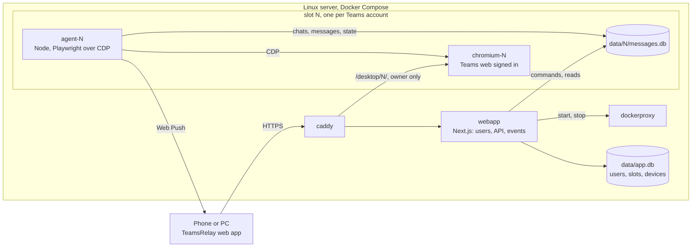

# TeamsRelay

Microsoft Teams on the phone for accounts whose organization allows Teams only in a desktop browser. A Chromium on your server keeps Teams web signed in, an agent reads and drives it, and an installable web app shows the chats, sends push notifications and performs the Teams actions: send, reply, react, edit, delete.

> Use TeamsRelay only with your own accounts and within the policies of your organization. The project is not affiliated with or endorsed by Microsoft; "Microsoft Teams" is a trademark of Microsoft.

## How it works



- Every person signs in to the web app with their own user and adds their Teams accounts. Each Teams account runs in its own slot: browser, agent, database and network.
- The Microsoft sign-in (password, MFA) happens in the remote browser of the slot, at `/desktop/N/`, reachable only by the owner of the slot.
- Actions in the web app become commands in the database of the slot. The agent performs them on the Teams page and confirms once Teams shows the change.
- Web app and agent are one TypeScript package (`app/`) and one image: the web app runs `node server.js`, each agent `node agent.cjs`.
- AI clients (Claude Code, opencode) can read the chats through the MCP endpoint `/mcp`, read only, when `MCP_TOKEN` is set: [docs/mcp.md](docs/mcp.md).

## Quick start

A Linux server with Docker Compose, a DNS name pointing to it, ports 80 and 443 reachable.

```bash
git clone <repository> /opt/teamsrelay && cd /opt/teamsrelay
cp .env.example .env          # DOMAIN, BETTER_AUTH_SECRET, ADMIN_EMAIL, ADMIN_PASSWORD
docker run --rm -v "$PWD:/w" -w /w node:24-slim node app/scripts/gen-vapid.mjs vapid
docker compose --profile accounts create --build
docker compose up -d
```

Open `https://<DOMAIN>`, sign in as the administrator, add a Teams account and sign in to Microsoft in its remote desktop. Step by step: [docs/setup.md](docs/setup.md).

## Documentation

| Topic | Page |
|---|---|
| Installation, users, first account, phone, local development | [docs/setup.md](docs/setup.md) |
| `.env` variables | [docs/configuration.md](docs/configuration.md) |
| Containers, agent loop, data | [docs/architecture.md](docs/architecture.md) |
| Deploy pipeline, updates, backup, troubleshooting | [docs/operations.md](docs/operations.md) |
| Security model | [docs/security.md](docs/security.md) |
| HTTP API | [docs/api.md](docs/api.md) |
| AI clients over MCP: setup, tools, limits | [docs/mcp.md](docs/mcp.md) |
| Teams selectors used by the agent | [docs/teams-selectors.md](docs/teams-selectors.md) |
| Known limitations | [docs/limitations.md](docs/limitations.md) |
| Decisions and plans | [docs/decisions/](docs/decisions/), [docs/design/](docs/design/) |

## License

See [LICENSE](LICENSE).
