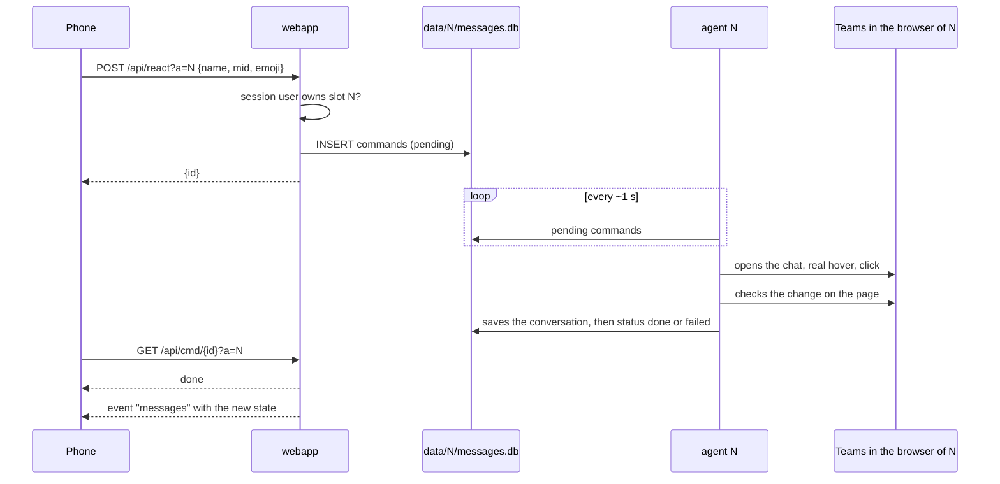

# Architecture

## Containers

| Service | Image | Role | Networks |
|---|---|---|---|
| `browsers` | `teamsrelay-browsers`, built from `./app` on `lscr.io/linuxserver/chromium` (pinned by digest) | Every Teams account: a Chromium with its own profile (`config/N`) and DevTools port, and its agent (`node agent.cjs`), started by the supervisor (`node supervisor.cjs`, an s6 service). One remote desktop (Selkies, port 3000) shows the window of every browser | `desktop` |
| `webapp` | `teamsrelay`, built from `./app` (Next.js, Node 26; UI on Tailwind CSS and shadcn/ui), runs `node server.js` | PWA, API, users and sessions, event stream; starts, stops and wipes the accounts through the supervisor; MCP endpoint for AI clients (`/mcp`, [mcp.md](mcp.md)) | `default` |
| `caddy` | `caddy:2.11.4-alpine` | HTTPS, reverse proxy, desktop gated by `/api/authcheck` | `default`, `desktop` |

Every Teams account of a server belongs to one person ([decision](decisions/2026-09-26-single-container.md)): the accounts share one container, one desktop and one loopback.

- The supervisor runs as root and listens on a unix socket in the volume `control`, which only the web app mounts besides it: `POST /accounts/N/start`, `stop`, `wipe`, `show` and `GET /accounts`. No container reaches Docker.
- Start of account N: its Chromium as `abc` (the `PUID` of the image), with `HOME` set to its profile directory (`/profiles/N`, `config/N` on the host) and DevTools on `127.0.0.1:(9221+N)`, then its agent as root with `CDP` pointing there. Stop: the agent first, then the browser with its process group. A process that exits is started again after 1 s, then after twice the previous delay up to 60 s while it keeps failing within 5 minutes of its start.
- The web app keeps the accounts running: every account with an owner is started, except those their owner stopped in Settings (`stopped` in `teams_accounts`), which keep their session and data until started again, and those checked every few hours (below). The check runs at the web app start and every 60 s: after a restart of the browsers container the accounts are back within a minute.
- Checked accounts (`check_every` in `teams_accounts`: 3600, 7200 or 14400 s; 0 is always on) run only while they are checked, to save memory (about 1.3 GB per running account). Every 10 s the web app (`app/src/lib/checks.ts`) takes the checked account whose `check_due` passed first, one at a time, and: starts it; waits for a health row written after the start with Teams `ok` (up to 4 minutes; Teams signed out for a minute is a sign-in to do, a shorter sign-out is a redirect of the start); queues the `check` command, which the agent runs once its side bar is clickable, and waits for it (up to 3 minutes; Teams signed out for a minute meanwhile is a sign-in to do); stops it and records `checked`, `check_result` (`ok`, `login`, `failed`) and the next `check_due`. A start the supervisor does not confirm in time is followed by a stop, queued after it. The interval is approximate: accounts due together are checked one after the other. A check holds the queue of add, remove, start and stop only to start and to stop the account, so a start or stop from the app does not wait for it; an account stopped, removed or set back to always on during its check ends it without a record. A check that finds a sign-in to do keeps the account up until the agent pushed its "Teams signed out" alert (up to 30 s more); "Check now" on such an account, or on one never signed in, waits ten minutes for the sign-in in the remote desktop. "Check now" during a check of the same account runs another one right after it. A checked account takes no command, during a check either (it stops right after reading), and its agent runs no automatic check of 8-11 and 17-20. At boot the web app stops the browser of every checked account: a check cut by a restart left it running. The app shows one status per account (stopped, always on, checked every N): a stopped account keeps its `check_every`, the mode it resumes when started with the Start button of its page; given a mode in Settings it is back in service, a checked one with a check asked at once.
- The start, stop, add, remove and keep-alive of the web app go through one queue for the whole process (`exclusive()` on `globalThis`): the Next.js build gives the boot code and each route a copy of the module of its own.
- Wipe, when an account is added or removed: the supervisor refuses it while the account runs, deletes every entry of `config/N`, checks that nothing is left and removes `config/N` itself; the web app then deletes `data/N`. The next start of the account creates the directory again.
- The windows of every browser open in the labwc session of the image. `/api/desktop/N` brings the window of account N to the front (`wlrctl`, Wayland app id `teamsrelay-N`), then redirects to `/desktop/`. A covered window keeps running at full speed (`--disable-backgrounding-occluded-windows`, `--disable-renderer-backgrounding`, `--disable-background-timer-throttling`).
- The agent connects to `http://127.0.0.1:(9221+N)`: Chromium binds DevTools on IPv4 only. DevTools have no authentication: every process of the container reaches every browser. They refuse connections that carry a web origin, so a page cannot open them.
- `app/Dockerfile` builds both images: target `web` holds the Next.js standalone output; target `browsers` holds Node 26, `agent.cjs` (esbuild bundle of `app/src/agent`), `supervisor.cjs` (bundle of `app/src/supervisor`) and the two packages the agent loads at runtime, `playwright-core` and `better-sqlite3`. Its build runs `node agent.cjs --check`, which fails when a package or a page script does not load in the image, and `node supervisor.cjs --check`.

## Web app and agent

The web app and the agent of a slot never call each other. They share `data/N/messages.db` (SQLite, WAL): the agent writes chats, messages, activity and state, the web app reads them and queues commands. Tables, row shapes, command types and arguments and state keys are described once, in `app/src/shared/slot-db`, and both sides use that module; the checks of what an app sends with a command are in `app/src/shared/command-input.ts`, used by the web app and by the [local relay](#local-relay). The Python agent of earlier releases used the same tables, so either agent can run a slot.



The conversation is saved before the command is marked as done: when the web app sees `done`, the new state is already in the database.

`data/app.db` holds what spans slots: users and sessions (better-auth), slot ownership (`teams_accounts`) and push subscriptions (`push_subscriptions`). The agent of slot N reads the owner of N and the devices of that owner; it writes nothing else there except the removal of expired subscriptions.

## Updates to the app

Each open app keeps one server-sent events stream, `/api/events?a=N&chat=<open chat>`. Every second the web app reads health, chat list, activity, call log and the open conversation of slot N (the account list every 5 s), and the calls ringing in every account of the user whose browser runs, and sends an event only for the parts whose content changed. Command outcomes are polled on `/api/cmd/{id}` while an action is pending. The `messages` event carries the last `open` of the chat as well: the app shows the messages saved at the last visit under *Opening in Teams* until its own open (or a later one) is done, and the reason when it failed, with **Try again**; *No messages in this chat* only after a done open.

The tabs count what waits: unread chats, the unread Activity items this device has not shown yet (Notifications), and the missed calls this device has not shown yet (Activity items of kind `call`), in red on the Calls tab. Teams shows a missed call as read, new or not, so its id alone tells a new one. Feed items carry no time: an older item that only a longer read of the feed shows counts as new (reads gave 30 items every time so far). The Notifications list marks what it shows but the missed calls, which only the Calls list marks. The account menu shows the same numbers for the other accounts, from `/api/accounts` (`unreadActivity`: ids of the unread items; `missedCalls`: ids of every missed call; `activityIds`: ids of every item, in feed order). An account a device meets for the first time counts every item it lists then as seen; so does, once, a seen list stored before missed calls counted by id. The app installed from Chrome or Edge shows the total of every account on its icon (Badging API; Windows, macOS, ChromeOS, and the Home Screen app of an iPhone); with no window of the app on screen, the service worker puts a dot there on every push but the end of a call, until the app shows the number again.

The icon of the installed app and the title of the page carry the total of every account, the one on screen included (`appBadgeCount`, `pageTitle` in `app/src/lib/client.ts`): `(5) TeamsRelay`. With no window of the app on screen, a push puts a dot on the icon (`sw.js`), which the app replaces with the number when it comes back.

A message that alerts rings a bell of the app instead of the sound of the device while a window of the app is open. The service worker asks the windows, the ones on screen first, one at a time and for 0.5 s each, whether their page played it (`{type: "bell"}` with a `MessagePort`, answered `{played}`, `app/public/sw.js`); the first that did makes the notification quiet (`silent`). A page plays it when the setting of its device is on (`localStorage` `bell`, **Settings**) and the browser lets it play sound (`Ringer.bell` in `app/src/lib/ring.ts`, on the audio context of the call ring, which rests again once the bell ends). No window, or none that played in time: the notification keeps the sound of the device. Calls keep their ring; a line sent again rings nothing.

The app names the open chat only while it is on screen. For such a stream the web app writes `viewing` (`{chat, ts}`) in the `state` table every 10 s, and the agent writes it on every command about a chat. The Teams page counts as visible and in use (presence stays Available), so it marks as read what arrives in the open chat: the agent keeps the chat of the app open while `viewing` is less than 90 s old, and otherwise shows the self chat (`wantedChat` in `app/src/agent/logic/parking.ts`). An app back on screen after a minute or more in the background asks for the chat again with `open`, as when it was chosen: Teams may be on the self chat by then, and the messages saved meanwhile show as such until that open is done.

The stream checks the session again every 60 s: a revoked session or a removed account ends it.

## Agent loop

About one round per second. Each step is a job of a small scheduler (`app/src/agent/loop.ts`), every N rounds at a fixed offset or every N seconds, in this order:

| When | What |
|---|---|
| every round | page visible and focused, Teams notification hook installed |
| every 60 s | real mouse and keyboard input, so Teams keeps you Available |
| every 5 rounds, no commands | the chat the app shows, or the self chat (parking) |
| every round | notifications caught by the hook (secondary source), queued commands (the chat list is read after each one) |
| every 300 rounds, Teams connected | full chat list, scrolled from top to bottom |
| every 3 rounds | visible chat list: pictures, previews, unread, muted; new message detection and push |
| every 150 rounds, Teams connected and its side bar clickable; after a start, as soon as it is | Activity feed (switches to the Activity view and back; the mouse goes first to a part of the side bar button nothing covers, such as the tooltip of the app launcher). While Teams starts (sign-in redirects, then loading) the side bar shows after the chat list and its loading bar covers it a few seconds more: a refresh asked then stays queued until the health check finds the side bar clickable, at most the 2 minutes a command may wait. A read that failed is tried once more 30 s later. Not in the local relay |
| every 300 rounds, or while unknown | identity: name, email, organization, picture |
| every 5 rounds, sign-in page included | health, and whether the Activity button of the side bar can be clicked (a menu or dialog over it counts as clickable: the Activity job closes it first); a push when Teams stays signed out for a minute, another when it is back |
| every round | open conversation |
| every 2 rounds, no commands | "Read by" of one of your recent messages in the open group chat; not in the local relay |
| every 300 rounds, the first time 31 rounds after a start | files of the media folder no row names any more removed: pictures of chats that left the list, of items gone from the feed, images of messages no longer kept |
| 8-11 and 17-20 | automatic check with a push of the outcome, once Teams shows its page (a start or a reload inside the window loads first; Teams still not ready 5 minutes into the window is reported); not on an account checked every few hours |

A message is new when the preview or the time of a chat changes with an incoming text, or when the chat turns unread. A time that turns into a date with the same preview is the same message getting older (the list shows the time of the last message for about a day). Muted chats and the chat with yourself do not notify; identical notifications within 150 s are dropped.

Incoming calls are watched beside the rounds, on a timer of their own that looks once a second (`app/src/agent/jobs/calls.ts`): Teams web rang 5 to 9 s in the tests of 2026-09-27, and a round can take longer (whole chat list, Activity feed, a send). The watch reads the toast Teams shows in the page (`readIncomingCall`, [selectors](teams-selectors.md#incoming-call)) and never touches its buttons. A call is pushed as soon as its toast shows, again every 5 s while it rings (for a minute at most), and once more when the toast has been gone 2 s; durations run on a clock that only goes forward. In the tests of 2026-09-27, with the page visible, Teams showed its own toasts for two calls and a chat message, and no browser notification: the notification hook caught none of them.

The watch also keeps the call in the `state` table for the web app (`call`: `{caller, since, seen, ringing}`, times in ms): written when it starts ringing, again every 2 s while its toast shows (for as long as it is pushed) and once it ends. Each call that ended goes to the `calls` table (the last 50), which the Calls tab lists with the missed calls of the Activity feed. The event stream sends `calls`, the calls ringing now in every running account of the user whose `seen` is at most 10 s old: the ring stops within 10 s of an agent that stopped or a page that went away. The main page of the open app (chats, notifications, calls; not Settings or Admin) shows a banner on top (*Anna Rossi is calling (Contoso)*; Mute silences that call, a tap opens its account) and loops a ring made in the page with Web Audio (`app/src/lib/ring.ts`: two trills and a rest, 3 s). The audio engine of the browser loops it, so a tab in the background, whose timers the browser slows down, rings as well. Browsers let a page play sound only after a click or a key press in it since it loaded, or in an installed app: the app makes its audio context at load; while the context may not run, the app shows *Click to allow the call ring*, and the first click, tap or key press anywhere allows it. Between two calls the context rests (suspended) and resumes when one rings, without a new click. When the event stream drops, no call counts as ringing until it is back; a stream the browser gave up (an error answer while the web app restarts) is opened again after 5 s.

A call answered from the app is heard in the app (`app/src/lib/call-audio/`, [design](design/2026-09-29-call-audio-in-app.md)): the page opens the websocket of Selkies, `/desktop/api/websockets`, behind the same Caddy gate as the desktop, asks for the audio with `START_AUDIO` and never for the video, and plays the Opus of the `0x01` frames through WebCodecs and a worklet. While Selkies asks for the microphone (`CAPTURE_DEMAND microphone 1`: Teams records from `SelkiesVirtualMic`), the page sends the microphone as Opus, mono at 24 kHz, in `0x02` frames, as Selkies' own page does; pcmflux plays it into the sink `input`. The sound stops with the call in progress, 30 s after an answer that never became one, on Hang up and when **Desktop** takes the call over. The page opens the microphone and plays on the speaker picked on the device (`app/src/lib/call-audio/devices.ts`, `AudioContext.setSinkId`), the default one when the picked one is gone; Mute turns the track of the microphone off, so the browser gives silence, and sends nothing.

An answer clicks *Accept with audio* at once, CDP mouse events at a point of the button nothing covers (`app/src/agent/teams/call-actions.ts`), with the Accept shortcut of Teams web as fallback, and counts once the toast is gone or a page records. Real input to a page runs one sequence at a time (`app/src/agent/teams/input.ts`), the presence keeper of the loop included, and the jobs of the loop that move Teams wait while a call rings, as during a call. Teams shows an answered call in its main window and may leave a post-meeting page there once it is over: the side bar shows, the chat list does not, the health says loading and those jobs keep waiting. The loop goes back to the chats with the Chat button of the side bar 3 s after a call, 2 min after anything else of that kind (someone may browse Teams in the desktop), again 15 s after a try that brought no list back, and reloads Teams after three (`backToChats` in `app/src/agent/jobs/page-setup.ts`).

A call that ended makes the loop read the Activity feed out of its turn, 8 s and 40 s later (`FeedAfterCalls` in `app/src/agent/jobs/missed-calls.ts`): Teams lists a missed call there, an answered one leaves nothing. An account always on pushes each missed call of the feed that no push told yet (*Missed call from Anna Rossi*, *Teams call at 10:05 AM, not answered*), at those reads, at the reads of its turn and at a refresh the app asks for. The ids told stay in the `state` table (`calls_told`, the last 200); the first feed an agent reads only records them, so a start pushes none of the past, and the calls its check pushed while it was checked every few hours count as told. An account checked every few hours leaves that to its check.

An account checked every few hours has no browser between its checks, so none of its calls rings anywhere. Its check pushes each missed call the Teams Activity feed lists that was not there at the previous check (*Missed call from Anna Rossi*, *Teams call at 1:15 PM, found by the check*), besides the summary push of what else is new. Teams shows a missed call as read, new or not: the check keeps the ids of the missed calls of its recent reads (up to 200) and pushes a call they did not have; an item saved without its Teams id is never pushed nor counted as new (its id is its place in the feed). Feed items carry no time, so an older call that only a longer read shows is pushed as new (reads gave 30 items every time so far). The first check after the web app sets the mode or starts the account again only records what it finds, and so does the first check after one of an earlier release that kept no missed calls; a check whose feed could not be read pushes no missed call, those calls come with the next check that reads it.

A new message is saved in the history, posted to ntfy when enabled and pushed to every device of the account owner, all at once (a push service that does not answer holds no other device): urgency `high`, kept by the push service for 24 hours, tagged with account and chat. The service worker keeps one notification per chat with its last five lines and alerts again on each new line; the account alerts (session expired, checks, Recheck) get a notification each, and the automatic check that passed goes out with urgency `normal`. A push answered with 429, a 5xx or nothing is sent again after 5, 30 and 120 s (a 429 after its `Retry-After`, up to 15 minutes), on timers outside the round, to the device only while it still belongs to the owner; 404 and 410 remove the device. Why: [2026-09-26-push-delivery.md](decisions/2026-09-26-push-delivery.md).

A call has one notification per account (tag `call-<slot>`, `call` in the payload). While it rings: urgency `high`, kept by the push service 60 s (later it could not be answered) and not sent again on a failure, since the next push follows in seconds; the service worker keeps it on screen (`requireInteraction`, with an Open button, without which Windows lets it go), vibrates and alerts again at every push (`renotify`). When the call stops the same notification turns quiet (`silent`), says who called and for how long, and is kept 24 hours like a message. A late push changes nothing: one of an older call (`ts`, when it started ringing), or a ringing one of a call already ended, only shows the notification there again, quiet. Safari devices (`web.push.apple.com`) get the start and the end of a call only: on an iPhone every push shows apart, the tag ignored ([WebKit bug 258922](https://bugs.webkit.org/show_bug.cgi?id=258922)), and `silent` is not supported. A web push cannot choose its sound: the device plays its own; only the open app rings with a sound of its own. Calls are not in the history. On ntfy a call rings when it starts (priority 5, `sequence_id` `call-<slot>-<since>`) and the same notification turns quiet when it ends (priority 2); a missed call found by a check goes there too.

The phones of the Android app (`mobile/`) are push devices as well: rows of `push_subscriptions` with endpoint `fcm:<token>` and `{fcm: {token, key, name, session}}`, which the app registers itself (`POST /api/push/fcm` with the session cookie of its web page, `DELETE` with the token once signed out or when it changes server). A row goes with the session that registered it (better-auth `databaseHooks.session.delete`): a sign-out, **Sign out every other device** or a password change elsewhere stops the pushes to a lost phone too, and the agent sends to a phone only while that session runs (the 30-day session of the web app), which also covers a session **Sign out every other device** skipped because it had run out. While the app is on screen, a new session cookie in its page (a sign-in, also under the same cookie name) or none (a sign-out) is noticed within 10 s. The agent sends them one FCM HTTP v1 data message per push (`app/src/agent/push/fcm.ts`: OAuth token of the service account from Google's `google-auth-library`, which signs the JWT and keeps the token until five minutes before its end; the message itself is one `fetch` to the HTTP v1 API, whose answer drives the removal and retry rules below), whose content, the same JSON as the Web Push payload, is sealed with the key of the phone (AES-256-GCM, data `{v, iv, ct}`): Google carries ciphertext only, as with Web Push. Texts are cut to fit the 4 KB of an FCM message. Priority `HIGH` (it wakes a phone in Doze) for an urgent push, `NORMAL` for the check that passed; TTL as for Web Push. `UNREGISTERED` (404), a token refused as invalid (400) and `SENDER_ID_MISMATCH` (403, a token of another Firebase project: logged as a warning, since a service account key of another project removes every phone) remove the phone; 429, 5xx and no answer are tried again as for Web Push. A call goes to a phone when it starts (TTL 60 s) and when it ends; a phone the first push did not reach gets the next push of the call, the others nothing in between: the app loops the ringtone itself, and FCM lowers the priority of the high-priority messages of an app that shows no notification for them. The plugin of the app (`mobile/plugin/android`) opens the message and shows a call on the Calls channel, whose sound is the ringtone of the phone, repeated (`FLAG_INSISTENT`) until the call ends, the notification is tapped or the shade opened, and cut after 65 s; a call that ended leaves a quiet notification; a chat keeps one notification with its last five lines; each alert has its own. Without the service account key (`fcm/service-account.json`) the phones get nothing and the agent says so once. The notifications of an account on another computer reach the phones the same way, sent by the web app with the same key (mounted at `/fcm`), which logs `FCM on: phones of the Android app` at start. Inside the app the page shows a ringing call without a ring of its own: the phone rings it.

The start page of the app, bundled with it, opens the server with its own address (`/?app=http://tauri.localhost/`). The web app keeps that address on the device (`localStorage` `appstart`, only `http(s)://tauri.localhost` pages) and offers **Change server** in the account menu and under the sign-in form: a plain link back to the start page (`#change`), which shows its form; the server page gets no access to Tauri. A visit to `/` without a session carries `a` (the account of a tapped notification) and `app` to `/login?next=`, so both survive the sign-in. The launcher shortcut **Change server** of the app does the same without the server page.

### Resilience

- **Virtualized lists**: Teams renders only the rows that fit the window, and the window depends on who looks at the remote desktop. Partial reads update the top of the list and keep the rest; the full read scrolls the list and rewrites it in one transaction. A chat further down is opened by scrolling the list from the top to the row of that exact name (a name that only starts the same is the last resort), then the list goes back to the top.
- **Teams reloads**: the agent finds the Teams tab again at the next round and reopens the chat in use; if it cannot see the Teams tab for 60 s it exits and the supervisor starts it again. A lost CDP connection (browser restarted) is opened again every 3 s, without touching the browser. The local relay instead opens Teams again in a blank tab after 5 s, and after 10 minutes on any other page (a sign-in may be in progress), and launches its browser again when it closes.
- **Errors**: a failing step is logged under its name and the round goes on; a command that throws ends as failed and is not run again.
- **Commands**: a command is `running` while the agent works on it. One left running by an agent that stopped (restart, crash) ends as `unconfirmed` and is never run again: a message may be out already, a reaction set. A command that waited more than 2 minutes ends as failed without touching Teams.
- **Right chat**: rows are matched by the exact name the app shows, a prefix only when a single row matches. Before saving a conversation the agent checks the title of the open chat (`[data-tid="chat-title"]`); a title that is another chat of the list never matches. Sending refuses to type when the open chat is not the requested one.

## How actions are performed

- **Action bar**: appears only with a real mouse hover, synthetic JavaScript events are ignored. It is drawn in a portal outside the message and two of them can be visible: the one closest to the message is used, clicked by coordinates.
- **Clicks by coordinates** (bar buttons, reaction pill, *Undo*, the person of the @ list) go only to a point where the target itself is on top (`elementFromPoint`): when something covers it, such as the toast of an incoming call with its *Accept* and *Decline* buttons at the bottom right, the command fails instead of clicking what covers it. Clicks through Playwright locators (chat rows, side bar, menus) wait for the same on their own.
- **Opening a chat**: click on the row. The only button inside the row is *More chat options*, with entries such as *Hide* and *Remove chat history*. The `open` command is done once Teams shows the chat and its messages are saved, and fails with its reason in `cmd_result:<id>` otherwise: Teams signed out or still loading (nothing clicked), no row of that name, a row that showed another chat, messages that could not be read.
- **Reactions**: quick buttons of the bar, or the picker for 😢 and 😠. Removing or adding from the pill under the message is a click on the pill (`aria-pressed` tells whether it is yours).
- **Send**: refused when Teams shows another chat or the compose box already holds a draft, which would go out with it. The text is typed, checked in the box and sent; whatever fails before the send leaves the box empty. The open chat is saved as soon as the message went, while Teams still shows it sending, and again at the end. Done once Teams shows the new message with its status icon (*Sending...* then *Sent*, drawn under the last message of yours only), unconfirmed when the message went out and Teams did not show it sent within 15 s: sending it again could make two. A click on Send that never happened (a panel over the button) leaves the text in the box and no new message: the box is emptied and the send fails.
- **Reply**: *Reply with quote*, on the bar for other people's messages and in *More options* for yours. Refused, like a send, when Teams shows another chat or the compose box holds a draft: Teams puts the quote above it and it would go out with the reply. After the quote the cursor is already in the box: the text is typed without clicking and sent with Enter. Done, failed or unconfirmed like a send.
- **Edit**: inline editor in the message, *Done* button. When something goes wrong the draft is discarded (*Discard draft*) and the message stays as it was.
- **Delete**: *More options → Delete*, immediate; *Undo* stays available for a short time.
- **Read by**: *Read by X of Y* entry of *More options* and its submenu with the names.
- **People of a chat** (for the @ of the app): in a group chat the list the participant count of the header opens, read and closed with Escape (it also holds buttons that remove people and leave the chat, never clicked); in the other chats the name in the header. Kept per chat in `state` (`members:<chat>`), read again after an hour.
- **Tagging with @**: the text is typed as it is; for each person the agent types `@` and the name word by word until the Teams list shows exactly that person, clicks it, and checks the mention in the compose box. Enter sends; the command is done once Teams shows the message sent with everyone tagged. Anything typed is removed from the compose box when a step fails, so it cannot go out with the next message.

## Content

- **Text**: the message body is rebuilt from the DOM as reduced HTML: known tags only, validated colours, http(s) links, text always escaped. The browser sanitizes it again (DOMPurify) before rendering. Teams emoji are images with the emoji in `alt`.
- **Images**: `blob:` or AMS URLs readable only inside the page, fetched by the page into `data/N/media` (8 MB cap). Giphy GIFs block CORS and stay public URLs. Until Teams has loaded an image it draws a 1x1 GIF in its place: the agent then fetches the address of `data-orig-src` and never saves that GIF (one saved by an earlier release is replaced).
- **Profile pictures**: the Teams API wants its own token and refuses `fetch`; the pictures are already drawn in the page, same origin, so they are copied from a canvas. One file per address (`sha1(src)[:16].png`): Teams gives a person the same address at every start (`profilepicturev2/<user id>?displayname=...&size=HR64x64`). A list of thousands of chats shows other people below its first screen at every start; the agent removes the files of those who left the list from its media folder (`data/N/media`, `state/media` of the local relay) with the other files no row names. The web app does the same in `data/N/media` of an account on another computer, after each sync of its relay that changed those rows.
- **Attachments**: SharePoint links downloaded with the browser session (`download=1`) into `data/N/files`, only for `*.sharepoint.com`, 100 MB cap.
- **Sending an image**: the web app writes it to `data/N/uploads` and queues `sendimage`; the agent builds the file inside the page from its bytes and pastes it in the compose box, types the caption and presses Enter, then waits for the message with the image to be sent (up to 30 s) and deletes the upload. Design: [2026-09-26-send-images.md](design/2026-09-26-send-images.md).

## SQLite tables

`data/N/messages.db`, one per slot, written by the agent:

| Table | Content |
|---|---|
| `chats` | chat list: name, preview, time, unread, mention, muted, picture |
| `chat_messages` | messages of the open chats; rich fields (HTML, images, files, reactions, status, read by) in `extra` as JSON |
| `readby` | "Read by" per message |
| `activity` | Activity feed |
| `check` | account checked every N hours: whole chat list and Activity feed, then one push per missed call of the feed that was not at the previous check (*Missed call from X*; by id, Teams shows missed calls as read), and one more (`N unread chats, M new notifications`, title followed by the organization) when a chat is unread with a preview it did not have unread at the previous check, or another Activity item is unread that was not (an item a read shows takes the state it has there, one it leaves out keeps the one of the reads before); nothing at the first check, nor at the first one after the web app set the mode or started the account (it deletes `check_seen`). What it saw stays in `check_seen` (`chats`, `activity` and `calls`: ids of the unread items and of the missed calls of the recent reads, newest first, up to 200 each, `read`), written before the pushes; a row without `calls` (earlier release) only records the missed calls. The chat list decides the outcome: a feed not read (an empty feed reads the same) keeps the notifications and missed calls of the last reads, and they are compared only between two feeds read |
| `commands` | commands queued by the web app, with outcome: `pending`, `running`, `done`, `failed`, `unconfirmed` (the web app reports `running` as `pending`, `unconfirmed` as `failed`); `key`, set by the app of the local relay, one command per key |
| `messages` | history of the notifications sent |
| `state` | health (with your Teams status), active chat, chat on screen in the app (`viewing`), identity (name, email, tenant, picture), command results, how long Teams has been signed out or the browser down (`login_watch`, `browser_watch`), the call ringing (`call`) and the call in progress (`in_call`, while the Teams page records from the microphone, with the mute of Teams, `muted`, while its microphone button can be read) |

`data/app.db`, shared:

| Table | Content |
|---|---|
| `user`, `session`, `account`, `verification` | better-auth: users (with `role`), sessions per device, password hashes |
| `teams_accounts` | slot, owner user id, time added, stopped by its owner (0/1), time of the last start from the app |
| `push_subscriptions` | endpoint, user id, Web Push subscription |
| `accounts`, `push_subs` | tables of the single-user release, read once for the migration and kept for a rollback |

## Local relay

One Teams account on a machine with a desktop session, without the containers: `node dist/relay.cjs`, the esbuild bundle of `app/src/local`, launches Chrome or Edge on a profile of its own (`app/state/profile`, signed in once with `npm run relay:login`), runs the agent above on it, pushes over Web Push and answers one bearer-token API with a text-only phone app (`app/src/local/web`, with the service worker, manifest and icons of `app/public`). pm2 keeps it running. Design, and what differs from the agent of a slot: [2026-09-26-local-relay.md](design/2026-09-26-local-relay.md).

| | Server product | Local relay |
|---|---|---|
| Browser | Chromium of the `browsers` container, DevTools port, supervisor | Chrome or Edge launched by Playwright over a pipe, headful, kept running by the relay |
| Sign-in | remote desktop `/desktop/` | the relay window |
| Database | `data/N/messages.db` per slot, `data/app.db` | `app/state/relay.db`: the tables of a slot database, plus `push_subscriptions` |
| Devices | per user, in `app.db` | subscribed from the app, in `relay.db` |
| Phone | web app (Next.js), users and sessions, event stream | one page, one token, polling ([api.md](api.md#local-relay)) |
| Activity feed, "Read by", @, images, downloads | yes | no |

A relay can also join a server as an **account on another computer** ([design](design/2026-09-27-relay-joins-server.md)): with `SERVER_URL` and `SERVER_TOKEN` it mirrors `relay.db` into `data/N/messages.db` of its slot on the server (`POST /api/relay/sync`), runs the commands the web app queues there (`GET /api/relay/commands`, a long wait), uploads its images and attachments, and hands its notifications to the web app, which sends them with the `Notifier` of the agents to the devices of the owner (`POST /api/relay/push`). The web app shows the account like the others; the supervisor never hears of that slot. Only the relay opens connections.

## Repository

```
teamsrelay/
├── docker-compose.yml     production stack: browsers, webapp, caddy
├── compose.local.yml      local overlay (Docker Desktop, 127.0.0.1, named volumes)
├── compose.local.env      local test values
├── .env.example
├── app/                   one package, two images: web app; browsers with agents and supervisor
│   ├── src/app, src/components, src/lib, src/server   Next.js web app
│   ├── src/agent          agent: loop, jobs, commands, Teams page scripts and selectors, push
│   ├── src/supervisor     supervisor of the browsers container: processes, accounts, control API
│   ├── src/local          local relay (dist/relay.cjs): config, browser keeper, lock, API, devices; web/ its phone app
│   ├── docker/browsers    s6 service of the supervisor, desktop autostart without browser
│   ├── src/shared         slot-db: contract of data/N/messages.db; checks of command input and HttpError
│   ├── scripts/           gen-vapid.mjs (push keys), seed-slot.mjs, capture-fixture.ts, relay-setup.mjs, relay-autostart.ps1
│   ├── ecosystem.config.cjs, relay.env.example   pm2 and settings of the local relay
│   └── test/              Vitest: web app, agent, page scripts in Chrome on captured fixtures, local relay
├── caddy/Caddyfile        routes, HTTPS, desktop gate
├── deploy/                remote-deploy.sh: deploy and rollback on the server
├── .github/               CI/CD, Dependabot
└── docs/                  this documentation, decisions, plans
```

Created at runtime, never in git: `config/N/` (browser profiles), `data/app.db`, `data/N/` (database, `media/`, `files/`, `uploads/`), `vapid/`, `fcm/`, `.caddyfile-sum`, `.deployed-sha`; for the local relay `app/state/` (profile, `relay.db`, `media/`, `vapid/`, `token`, `relay.lock`) and `app/relay.env`, also kept out of the Docker build context.
