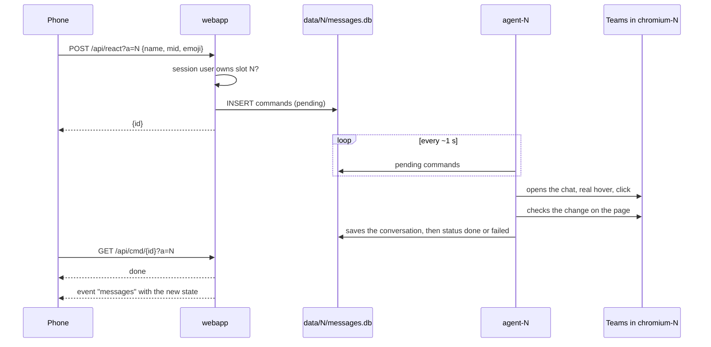

# Architecture

## Containers

| Service | Image | Role | Networks |
|---|---|---|---|
| `chromium-1` ... `chromium-4` | `lscr.io/linuxserver/chromium`, pinned by digest | Teams web of slot N, profile in `config/N/`, CDP on `127.0.0.1:9222`, desktop stream on port 3000 | `slotN` |
| `agent-1` ... `agent-4` | `./agent` (Python, Playwright) | Reads and drives Teams of slot N, sends the push notifications | network namespace of `chromium-N` |
| `webapp` | `./webapp` (Next.js, Node 24; UI on Tailwind CSS and shadcn/ui) | PWA, API, users and sessions, event stream, slot start and stop | `default`, `control` |
| `dockerproxy` | `wollomatic/socket-proxy` | Docker socket filter: only `POST /containers/teams-(chromium\|agent)-N/(start\|stop)` | `control` (internal) |
| `caddy` | `caddy:2.11.4-alpine` | HTTPS, reverse proxy, desktop routes gated by `/api/authcheck` | `default`, `slot1` ... `slot4` |

- `chromium-N` and `agent-N` belong to the `accounts` profile: `docker compose up -d` does not start them. The deploy creates them stopped; the web app starts the slots that have an owner and keeps them running (check every 60 s).
- A slot network holds one browser and Caddy. A page open in the browser of slot 1 cannot reach the browser of slot 2, the web app or the socket proxy.
- The agent connects to `http://127.0.0.1:9222`: Chromium binds CDP on IPv4 only, and `localhost` in the container resolves to `::1` first.

## Web app and agent

The web app and the agent of a slot never call each other. They share `data/N/messages.db` (SQLite, WAL): the agent writes chats, messages, activity and state, the web app reads them and queues commands.



The conversation is saved before the command is marked as done: when the web app sees `done`, the new state is already in the database.

`data/app.db` holds what spans slots: users and sessions (better-auth), slot ownership (`teams_accounts`) and push subscriptions (`push_subscriptions`). The agent of slot N reads the owner of N and the devices of that owner; it writes nothing else there except the removal of expired subscriptions.

## Updates to the app

Each open app keeps one server-sent events stream, `/api/events?a=N&chat=<open chat>`. Every second the web app reads health, chat list, activity and the open conversation of slot N (the account list every 5 s) and sends an event only for the parts whose content changed. Command outcomes are polled on `/api/cmd/{id}` while an action is pending.

The app names the open chat only while it is on screen. For such a stream the web app writes `viewing` (`{chat, ts}`) in the `state` table every 10 s, and the agent writes it on every command about a chat. The Teams page counts as visible and in use (presence stays Available), so it marks as read what arrives in the open chat: the agent keeps the chat of the app open while `viewing` is less than 90 s old, and otherwise shows the self chat (`wanted_chat` in `agent/agent.py`).

The stream checks the session again every 60 s: a revoked session or a removed account ends it.

## Agent loop

About one round per second:

| When | What |
|---|---|
| every round | Teams notification hook (secondary source), queued commands, open conversation |
| every ~3 rounds | visible chat list: pictures, previews, unread, muted; new message detection and push |
| every ~5 rounds | health; if the session expired, one push |
| every 2 rounds, no commands | "Read by" of one of your recent messages in the open group chat |
| every ~150 rounds | Activity feed (switches to the Activity view and back) |
| every ~300 rounds | full chat list, scrolled from top to bottom |
| 8-11 and 17-20 | automatic check with a push of the outcome |

A message is new when the preview or the time of a chat changes with an incoming text, or when the chat turns unread. Muted chats and the chat with yourself do not notify; identical notifications within 150 s are dropped.

### Resilience

- **Virtualized lists**: Teams renders only the rows that fit the window, and the window depends on who looks at the remote desktop. Partial reads update the top of the list and keep the rest; the full read scrolls the list and rewrites it in one transaction.
- **Teams reloads**: the agent drops the old CDP connection and opens a new one; with no chat open it reopens the one in use; if it cannot see the Teams tab for 60 s it exits and Docker restarts it.
- **Right chat**: rows are matched by the exact name the app shows, a prefix only when a single row matches. Before saving a conversation the agent checks the title of the open chat (`[data-tid="chat-title"]`); a title that is another chat of the list never matches. Sending refuses to type when the open chat is not the requested one.

## How actions are performed

- **Action bar**: appears only with a real mouse hover, synthetic JavaScript events are ignored. It is drawn in a portal outside the message and two of them can be visible: the one closest to the message is used, clicked by coordinates.
- **Opening a chat**: click on the row. The only button inside the row is *More chat options*, with entries such as *Hide* and *Remove chat history*.
- **Reactions**: quick buttons of the bar, or the picker for 😢 and 😠. Removing or adding from the pill under the message is a click on the pill (`aria-pressed` tells whether it is yours).
- **Reply**: *Reply with quote*, on the bar for other people's messages and in *More options* for yours. After the quote the cursor is already in the box: the text is typed without clicking and sent with Enter.
- **Edit**: inline editor in the message, *Done* button. When something goes wrong the draft is discarded (*Discard draft*) and the message stays as it was.
- **Delete**: *More options → Delete*, immediate; *Undo* stays available for a short time.
- **Read by**: *Read by X of Y* entry of *More options* and its submenu with the names.

## Content

- **Text**: the message body is rebuilt from the DOM as reduced HTML: known tags only, validated colours, http(s) links, text always escaped. The browser sanitizes it again (DOMPurify) before rendering. Teams emoji are images with the emoji in `alt`.
- **Images**: `blob:` or AMS URLs readable only inside the page, fetched by the page into `data/N/media` (8 MB cap). Giphy GIFs block CORS and stay public URLs.
- **Profile pictures**: the Teams API wants its own token and refuses `fetch`; the pictures are already drawn in the page, same origin, so they are copied from a canvas.
- **Attachments**: SharePoint links downloaded with the browser session (`download=1`) into `data/N/files`, only for `*.sharepoint.com`, 100 MB cap.

## SQLite tables

`data/N/messages.db`, one per slot, written by the agent:

| Table | Content |
|---|---|
| `chats` | chat list: name, preview, time, unread, mention, muted, picture |
| `chat_messages` | messages of the open chats; rich fields (HTML, images, files, reactions, status, read by) in `extra` as JSON |
| `readby` | "Read by" per message |
| `activity` | Activity feed |
| `commands` | commands queued by the web app, with outcome |
| `messages` | history of the notifications sent |
| `state` | health (with your Teams status), active chat, chat on screen in the app (`viewing`), identity (name, email, tenant, picture), command results |

`data/app.db`, shared:

| Table | Content |
|---|---|
| `user`, `session`, `account`, `verification` | better-auth: users (with `role`), sessions per device, password hashes |
| `teams_accounts` | slot, owner user id, time added |
| `push_subscriptions` | endpoint, user id, Web Push subscription |
| `accounts`, `push_subs` | tables of the single-user release, read once for the migration and kept for a rollback |

## Repository

```
teamsrelay/
├── docker-compose.yml     production stack
├── compose.local.yml      local overlay (Docker Desktop, 127.0.0.1, named volumes)
├── compose.local.env      local test values
├── .env.example
├── agent/                 agent.py, tests, Dockerfile, requirements.txt
├── webapp/                Next.js app: src/app (pages and API), src/lib, src/components, test/
├── caddy/Caddyfile        routes, HTTPS, desktop gate
├── deploy/                remote-deploy.sh: deploy and rollback on the server
├── .github/               CI/CD, Dependabot
├── docs/                  this documentation, decisions, plans
└── tools/                 VAPID keys, icons
```

Created at runtime, never in git: `config/N/` (browser profiles), `data/app.db`, `data/N/` (database, `media/`, `files/`), `vapid/`, `.caddyfile-sum`, `.deployed-sha`.
