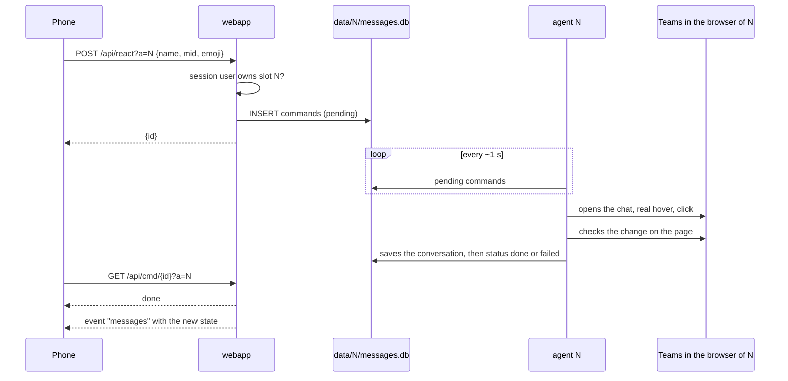

# Architecture

## Containers

| Service | Image | Role | Networks |
|---|---|---|---|
| `browsers` | `teamsrelay-browsers`, built from `./app` on `lscr.io/linuxserver/chromium` (pinned by digest) | Every Teams account: a Chromium with its own profile (`config/N`) and DevTools port, and its agent (`node agent.cjs`), started by the supervisor (`node supervisor.cjs`, an s6 service). One remote desktop (Selkies, port 3000) shows the window of every browser | `desktop` |
| `webapp` | `teamsrelay`, built from `./app` (Next.js, Node 26; UI on Tailwind CSS and shadcn/ui), runs `node server.js` | PWA, API, users and sessions, event stream; starts, stops and wipes the accounts through the supervisor; MCP endpoint for AI clients (`/mcp`, [mcp.md](mcp.md)) | `default` |
| `caddy` | `caddy:2.11.4-alpine` | HTTPS, reverse proxy, desktop gated by `/api/authcheck` | `default`, `desktop` |

Every Teams account of a server belongs to one person ([decision](decisions/2026-09-26-single-container.md)): the accounts share one container, one desktop and one loopback.

- The supervisor runs as root and listens on a unix socket in the volume `control`, which only the web app mounts besides it: `POST /accounts/N/start`, `stop`, `wipe`, `show` and `GET /accounts`. No container reaches Docker.
- Start of account N: its Chromium as `abc` (the `PUID` of the image), with `HOME` set to its profile directory (`/profiles/N`, `config/N` on the host) and DevTools on `127.0.0.1:(9221+N)`, then its agent as root with `CDP` pointing there. Stop: the agent first, then the browser with its process group. A process that exits is started again after 1 s, then after twice the previous delay up to 60 s while it keeps failing within 5 minutes of its start.
- The web app keeps the accounts running: every account with an owner is started, except those their owner stopped from the account menu (`stopped` in `teams_accounts`), which keep their session and data until started again. The check runs at the web app start and every 60 s: after a restart of the browsers container the accounts are back within a minute.
- Wipe, when an account is added or removed: the supervisor refuses it while the account runs, deletes every entry of `config/N` and checks that nothing is left; the web app then deletes `data/N`.
- The windows of every browser open in the labwc session of the image. `/api/desktop/N` brings the window of account N to the front (`wlrctl`, Wayland app id `teamsrelay-N`), then redirects to `/desktop/`. A covered window keeps running at full speed (`--disable-backgrounding-occluded-windows`, `--disable-renderer-backgrounding`, `--disable-background-timer-throttling`).
- The agent connects to `http://127.0.0.1:(9221+N)`: Chromium binds DevTools on IPv4 only. DevTools have no authentication: every process of the container reaches every browser. They refuse connections that carry a web origin, so a page cannot open them.
- `app/Dockerfile` builds both images: target `web` holds the Next.js standalone output; target `browsers` holds Node 26, `agent.cjs` (esbuild bundle of `app/src/agent`), `supervisor.cjs` (bundle of `app/src/supervisor`) and the two packages the agent loads at runtime, `playwright-core` and `better-sqlite3`. Its build runs `node agent.cjs --check`, which fails when a package or a page script does not load in the image, and `node supervisor.cjs --check`.

## Web app and agent

The web app and the agent of a slot never call each other. They share `data/N/messages.db` (SQLite, WAL): the agent writes chats, messages, activity and state, the web app reads them and queues commands. Tables, row shapes, command types and arguments and state keys are described once, in `app/src/shared/slot-db`, and both sides use that module. The Python agent of earlier releases used the same tables, so either agent can run a slot.



The conversation is saved before the command is marked as done: when the web app sees `done`, the new state is already in the database.

`data/app.db` holds what spans slots: users and sessions (better-auth), slot ownership (`teams_accounts`) and push subscriptions (`push_subscriptions`). The agent of slot N reads the owner of N and the devices of that owner; it writes nothing else there except the removal of expired subscriptions.

## Updates to the app

Each open app keeps one server-sent events stream, `/api/events?a=N&chat=<open chat>`. Every second the web app reads health, chat list, activity and the open conversation of slot N (the account list every 5 s) and sends an event only for the parts whose content changed. Command outcomes are polled on `/api/cmd/{id}` while an action is pending.

The app names the open chat only while it is on screen. For such a stream the web app writes `viewing` (`{chat, ts}`) in the `state` table every 10 s, and the agent writes it on every command about a chat. The Teams page counts as visible and in use (presence stays Available), so it marks as read what arrives in the open chat: the agent keeps the chat of the app open while `viewing` is less than 90 s old, and otherwise shows the self chat (`wantedChat` in `app/src/agent/logic/parking.ts`).

The stream checks the session again every 60 s: a revoked session or a removed account ends it.

## Agent loop

About one round per second. Each step is a job of a small scheduler (`app/src/agent/loop.ts`), every N rounds at a fixed offset or every N seconds, in this order:

| When | What |
|---|---|
| every round | page visible and focused, Teams notification hook installed |
| every 60 s | real mouse and keyboard input, so Teams keeps you Available |
| every 5 rounds, no commands | the chat the app shows, or the self chat (parking) |
| every round | notifications caught by the hook (secondary source), queued commands (the chat list is read after each one) |
| every 300 rounds, Teams connected | full chat list, scrolled from top to bottom |
| every 3 rounds | visible chat list: pictures, previews, unread, muted; new message detection and push |
| every 150 rounds, Teams connected | Activity feed (switches to the Activity view and back) |
| every 300 rounds, or while unknown | identity: name, email, organization, picture |
| every 5 rounds, sign-in page included | health; if the session expired, one push |
| every round | open conversation |
| every 2 rounds, no commands | "Read by" of one of your recent messages in the open group chat |
| 8-11 and 17-20 | automatic check with a push of the outcome |

A message is new when the preview or the time of a chat changes with an incoming text, or when the chat turns unread. Muted chats and the chat with yourself do not notify; identical notifications within 150 s are dropped.

A new message is saved in the history, posted to ntfy when enabled and pushed to every device of the account owner: urgency `high`, kept by the push service for 24 hours, tagged with account and chat. The service worker keeps one notification per chat with its last five lines and alerts again on each new line; the account alerts (session expired, checks, Recheck) get a notification each, and the automatic check that passed goes out with urgency `normal`. A push answered with 429, a 5xx or nothing is sent again after 5, 30 and 120 s (a 429 after its `Retry-After`, up to 15 minutes), on timers outside the round, to the device only while it still belongs to the owner; 404 and 410 remove the device. Why: [2026-09-26-push-delivery.md](decisions/2026-09-26-push-delivery.md).

### Resilience

- **Virtualized lists**: Teams renders only the rows that fit the window, and the window depends on who looks at the remote desktop. Partial reads update the top of the list and keep the rest; the full read scrolls the list and rewrites it in one transaction.
- **Teams reloads**: the agent finds the Teams tab again at the next round and reopens the chat in use; if it cannot see the Teams tab for 60 s it exits and the supervisor starts it again. A lost CDP connection (browser restarted) is opened again every 3 s, without touching the browser.
- **Errors**: a failing step is logged under its name and the round goes on; a command that throws ends as failed and is not run again.
- **Right chat**: rows are matched by the exact name the app shows, a prefix only when a single row matches. Before saving a conversation the agent checks the title of the open chat (`[data-tid="chat-title"]`); a title that is another chat of the list never matches. Sending refuses to type when the open chat is not the requested one.

## How actions are performed

- **Action bar**: appears only with a real mouse hover, synthetic JavaScript events are ignored. It is drawn in a portal outside the message and two of them can be visible: the one closest to the message is used, clicked by coordinates.
- **Opening a chat**: click on the row. The only button inside the row is *More chat options*, with entries such as *Hide* and *Remove chat history*.
- **Reactions**: quick buttons of the bar, or the picker for 😢 and 😠. Removing or adding from the pill under the message is a click on the pill (`aria-pressed` tells whether it is yours).
- **Reply**: *Reply with quote*, on the bar for other people's messages and in *More options* for yours. After the quote the cursor is already in the box: the text is typed without clicking and sent with Enter.
- **Edit**: inline editor in the message, *Done* button. When something goes wrong the draft is discarded (*Discard draft*) and the message stays as it was.
- **Delete**: *More options → Delete*, immediate; *Undo* stays available for a short time.
- **Read by**: *Read by X of Y* entry of *More options* and its submenu with the names.
- **People of a chat** (for the @ of the app): in a group chat the list the participant count of the header opens, read and closed with Escape (it also holds buttons that remove people and leave the chat, never clicked); in the other chats the name in the header. Kept per chat in `state` (`members:<chat>`), read again after an hour.
- **Tagging with @**: the text is typed as it is; for each person the agent types `@` and the name word by word until the Teams list shows exactly that person, clicks it, and checks the mention in the compose box. Enter sends; the command is done once Teams shows the message sent with everyone tagged. Anything typed is removed from the compose box when a step fails, so it cannot go out with the next message.

## Content

- **Text**: the message body is rebuilt from the DOM as reduced HTML: known tags only, validated colours, http(s) links, text always escaped. The browser sanitizes it again (DOMPurify) before rendering. Teams emoji are images with the emoji in `alt`.
- **Images**: `blob:` or AMS URLs readable only inside the page, fetched by the page into `data/N/media` (8 MB cap). Giphy GIFs block CORS and stay public URLs. Until Teams has loaded an image it draws a 1x1 GIF in its place: the agent then fetches the address of `data-orig-src` and never saves that GIF (one saved by an earlier release is replaced).
- **Profile pictures**: the Teams API wants its own token and refuses `fetch`; the pictures are already drawn in the page, same origin, so they are copied from a canvas.
- **Attachments**: SharePoint links downloaded with the browser session (`download=1`) into `data/N/files`, only for `*.sharepoint.com`, 100 MB cap.
- **Sending an image**: the web app writes it to `data/N/uploads` and queues `sendimage`; the agent builds the file inside the page from its bytes and pastes it in the compose box, types the caption and presses Enter, then waits for the message with the image to be sent (up to 30 s) and deletes the upload. Design: [2026-09-26-send-images.md](design/2026-09-26-send-images.md).

## SQLite tables

`data/N/messages.db`, one per slot, written by the agent:

| Table | Content |
|---|---|
| `chats` | chat list: name, preview, time, unread, mention, muted, picture |
| `chat_messages` | messages of the open chats; rich fields (HTML, images, files, reactions, status, read by) in `extra` as JSON |
| `readby` | "Read by" per message |
| `activity` | Activity feed |
| `commands` | commands queued by the web app, with outcome |
| `messages` | history of the notifications sent |
| `state` | health (with your Teams status), active chat, chat on screen in the app (`viewing`), identity (name, email, tenant, picture), command results |

`data/app.db`, shared:

| Table | Content |
|---|---|
| `user`, `session`, `account`, `verification` | better-auth: users (with `role`), sessions per device, password hashes |
| `teams_accounts` | slot, owner user id, time added, stopped by its owner (0/1), time of the last start from the app |
| `push_subscriptions` | endpoint, user id, Web Push subscription |
| `accounts`, `push_subs` | tables of the single-user release, read once for the migration and kept for a rollback |

## Repository

```
teamsrelay/
├── docker-compose.yml     production stack: browsers, webapp, caddy
├── compose.local.yml      local overlay (Docker Desktop, 127.0.0.1, named volumes)
├── compose.local.env      local test values
├── .env.example
├── app/                   one package, two images: web app; browsers with agents and supervisor
│   ├── src/app, src/components, src/lib, src/server   Next.js web app
│   ├── src/agent          agent: loop, jobs, commands, Teams page scripts and selectors, push
│   ├── src/supervisor     supervisor of the browsers container: processes, accounts, control API
│   ├── docker/browsers    s6 service of the supervisor, desktop autostart without browser
│   ├── src/shared/slot-db contract of data/N/messages.db, used by both
│   ├── scripts/           gen-vapid.mjs (push keys), seed-slot.mjs, capture-fixture.ts
│   └── test/              Vitest: web app, agent, page scripts in Chrome on captured fixtures
├── caddy/Caddyfile        routes, HTTPS, desktop gate
├── deploy/                remote-deploy.sh: deploy and rollback on the server
├── .github/               CI/CD, Dependabot
└── docs/                  this documentation, decisions, plans
```

Created at runtime, never in git: `config/N/` (browser profiles), `data/app.db`, `data/N/` (database, `media/`, `files/`, `uploads/`), `vapid/`, `.caddyfile-sum`, `.deployed-sha`.
