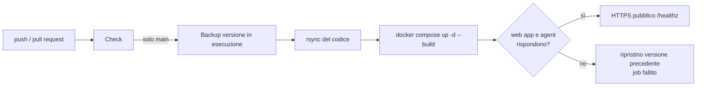

# Deploy automatico

Il workflow `.github/workflows/ci-cd.yml` controlla ogni push e, su `main`, aggiorna il server.



## Job

**Check**, a ogni push e pull request:

- sintassi Python di agent, web app e strumenti;
- sintassi JavaScript di `index.html`, `login.html` e del service worker;
- sintassi degli script shell;
- validazione di `docker-compose.yml` e di `compose.local.yml`;
- build delle immagini `agent` e `webapp`;
- build della documentazione.

**Deploy**, a ogni push su `main` o a mano da *Actions → CI/CD → Run workflow*:

1. salva il codice in esecuzione sul server (`deploy/remote-deploy.sh backup`);
2. copia il codice con `rsync --delete`;
3. `docker compose up -d --build` e attesa che web app e agent siano su;
4. se non salgono, rimette la versione precedente e il job fallisce;
5. controlla `https://<dominio>/healthz` da Internet.

Un solo deploy alla volta: i push ravvicinati si mettono in coda.

Sul server il deploy **non tocca mai** `.env`, `config/` (sessione Teams), `data/` (database, immagini, file) e `vapid/`. Il container `chromium` non viene ricreato se non cambia la sua configurazione, quindi la sessione Teams sopravvive ai deploy.

## Secrets e variabili

In *Settings → Secrets and variables → Actions* del repository:

| Nome | Tipo | Contenuto |
|---|---|---|
| `DEPLOY_HOST` | secret | IP o nome del server |
| `DEPLOY_USER` | secret | utente di deploy, nel gruppo `docker` |
| `DEPLOY_SSH_KEY` | secret | chiave privata SSH dedicata al deploy |
| `DEPLOY_KNOWN_HOSTS` | secret | output di `ssh-keyscan -t ed25519 <host>`: la host key è fissata, niente `StrictHostKeyChecking=no` |
| `DEPLOY_DOMAIN` | variabile | dominio pubblico, per il controllo finale |

## Primo setup del server

Una volta sola, poi fa tutto il workflow.

```bash
# utente di deploy, solo chiave
sudo useradd -m -s /bin/bash -G docker teamsrelay
sudo install -d -m 700 -o teamsrelay -g teamsrelay /home/teamsrelay/.ssh
echo "<chiave pubblica di deploy>" | sudo tee /home/teamsrelay/.ssh/authorized_keys
sudo chown teamsrelay: /home/teamsrelay/.ssh/authorized_keys && sudo chmod 600 /home/teamsrelay/.ssh/authorized_keys

# cartella dell'app con .env e chiavi VAPID
sudo install -d -o teamsrelay -g teamsrelay /opt/teamsrelay
```

Poi, come utente `teamsrelay`: `.env` in `/opt/teamsrelay` ([Configurazione](/guida/configurazione)), chiavi VAPID in `/opt/teamsrelay/vapid` ([Installazione, passo 5](/guida/installazione#_5-chiavi-per-le-notifiche-push)), porte 80 e 443 aperte ([Installazione, passo 1](/guida/installazione#_1-server)).

La chiave di deploy si genera così e la parte privata va nel secret `DEPLOY_SSH_KEY`:

```bash
ssh-keygen -t ed25519 -N "" -C "teamsrelay-deploy@github-actions" -f teamsrelay-deploy
```

Al primo deploy manca solo il login a Teams, da fare a mano su `https://<DOMAIN>/desktop/` ([Installazione, passo 7](/guida/installazione#_7-primo-login-a-teams)).

## Rollback manuale

Rilanciare il workflow su un commit precedente (*Run workflow* dopo un `git revert` su `main`), oppure sul server:

```bash
cd /opt/teamsrelay
cat .deployed-sha                      # versione in esecuzione
tar -xzf /var/tmp/teamsrelay-prev.tgz  # versione precedente al deploy
docker compose up -d --build
```
