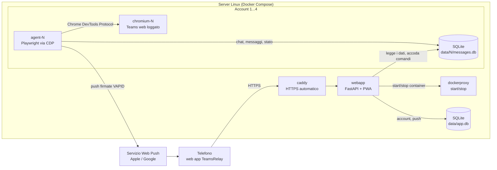

# Introduzione

::: warning Avvertenze
Usa TeamsRelay solo con il **tuo** account e nel rispetto delle policy della tua organizzazione: automatizza una sessione web di Teams a tuo nome. Il progetto non è affiliato né approvato da Microsoft. Se Microsoft cambia l'interfaccia di Teams web, alcune funzioni smettono di funzionare finché i [selettori](/riferimento/selettori) non vengono aggiornati.
:::

## Perché esiste

Alcuni account Microsoft 365, per licenza o per regole di *conditional access*, possono usare Teams **solo dal browser del PC**: le app Teams per Windows, iPhone e Android sono bloccate e Teams web sul telefono non si apre. Lontano dal PC non arrivano né chat né notifiche.

TeamsRelay sposta il browser su un server: un Chromium in un container tiene aperto Teams web con il tuo account, un agent lo legge e lo comanda come faresti tu con mouse e tastiera, e una web app mobile ti mostra tutto e ti manda le notifiche.

## Cosa fa

| Area | Funzioni |
|---|---|
| Account | Fino a 4 account Teams contemporanei. Aggiungi, rimuovi e passa da un account all'altro nella parte alta dell'app. Notifiche di tutti gli account su un unico dispositivo. |
| Lista chat | Foto profilo e foto dei gruppi, anteprima, orario, non letti, chat silenziate con la campanella barrata, filtri Tutte / Non lette / Menzioni, ordine. |
| Messaggi | Testo con la formattazione di Teams (colori, grassetto, elenchi, codice, link), menzioni evidenziate (in rosso quelle a te), emoji, immagini, GIF, file, citazioni, autore e foto nei gruppi, "Modificato". |
| Azioni | Invia, rispondi con citazione, reagisci con sei reazioni rapide, tocca una reazione per toglierla o aggiungerla, modifica ed elimina i tuoi messaggi, annulla l'eliminazione, scarica gli allegati. |
| Stato dei tuoi messaggi | *Inviato*, *Visualizzato*, e nei gruppi *Letto da N su M* con i nomi. |
| Notifiche | Web Push sul telefono per i messaggi nuovi (non per le chat silenziate). Con più account, la notifica riporta l'account. Scheda **Notifiche** con il feed Attività di Teams: reazioni ai tuoi messaggi, menzioni, risposte, inviti. |
| Affidabilità | Pannello di stato verde solo se tutto il giro funziona, push quando la sessione scade, controllo automatico due volte al giorno. Ogni account ha il suo browser e il suo database. |
| Desktop | Scheda Desktop (solo da telefono) con il browser remoto dell'account, per il login e l'MFA. |

## Come funziona

Fino a 4 account Teams girati in parallelo, ognuno con il suo browser e il suo database.

1. **chromium-N** e **agent-N** (slot 1...4): ogni account ha il suo Chromium con Teams web e il suo agent. I login li fai dal desktop remoto dell'account (`/desktop/N/`) e le sessioni restano in `config/N/`. Gli slot non in uso non consumano risorse.
2. **webapp** serve la web app e le API. Le tue azioni (apri, invia, reagisci, modifica...) diventano **comandi** nel database dell'account, che l'agent di quell'account esegue sulla pagina. La webapp parla con Docker (tramite dockerproxy) solo per accendere e spegnere i slot degli account.
3. **dockerproxy** è un filtro: la webapp può solo accendere e spegnere container già creati, tutto il resto è negato (creare, eseguire, listare, ispezionare).
4. **caddy** pubblica la web app in HTTPS con certificati Let's Encrypt.

Il database di ogni account è l'unico canale fra web app e agent di quell'account. Il database dell'app (app.db) condiviso contiene l'elenco degli account e le sottoscrizioni push. I dettagli sono in [Architettura](/riferimento/architettura).

## Da dove partire

- Server nuovo: [Installazione](/guida/installazione), poi [App sul telefono](/guida/telefono).
- Aggiornamenti automatici a ogni push: [Deploy automatico](/guida/deploy).
- Provare sul PC prima di usare un server: [Sviluppo in locale](/guida/sviluppo-locale).
