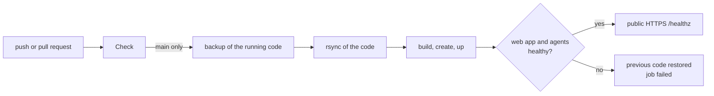

# Operations

## Deploy pipeline

`.github/workflows/ci-cd.yml` checks every push and pull request, and deploys `main` to the server.



**Check**, on every push and pull request: lint, type check, tests and build of `app/` (web app, agent and local relay; the page scripts run in Chrome on pages captured from Teams, the agent bundle runs as a process against a local Chrome, the local relay in one process against a page that behaves like Teams); `node dist/agent.cjs --check`, `node dist/supervisor.cjs --check`, `node dist/relay.cjs --check`; deploy script syntax; both Compose files; Caddyfile; both images, the browsers one failing its build when the agent or the supervisor does not load in it.

**Deploy**, on every push to `main` or by hand (*Actions → CI/CD → Run workflow*):

1. `deploy/remote-deploy.sh backup` saves the running code.
2. `rsync --delete` uploads the code.
3. `remote-deploy.sh up` checks `.env` (session key), builds both images, starts browsers, web app and Caddy, removes the containers of services no longer in `docker-compose.yml`, and restarts Caddy when the Caddyfile changed.
4. The web app must answer, and every agent the supervisor runs must keep its restart count and write a health row younger than a minute (an agent with a wrong environment or VAPID key stops at start and restarts in a loop); otherwise the previous code comes back and the job fails.
5. `https://<DOMAIN>/healthz` is checked from the Internet.

One deploy at a time: close pushes queue up. The deploy never touches `.env`, `config/`, `data/`, `vapid/` or `fcm/`. The browsers container is recreated when its image or its configuration changes (a Chromium update, a release of the agent or of the supervisor): every account restarts and the web app starts them again within a minute. The Teams sessions stay in `config/` and survive deploys.

The first deploy of the browsers container removes the containers of the releases before it (`chromium-N`, `agent-N`, `wipe-N`, `dockerproxy`) and starts `browsers` on the same `config/N`: the accounts stay signed in. The volume `wipe` of those releases is then unused: `docker volume rm teamsrelay_wipe`.

Secrets and variables of the repository (*Settings → Secrets and variables → Actions*):

| Name | Type | Content |
|---|---|---|
| `DEPLOY_HOST` | secret | IP or name of the server |
| `DEPLOY_USER` | secret | deploy user, member of the `docker` group |
| `DEPLOY_SSH_KEY` | secret | private SSH key dedicated to the deploy |
| `DEPLOY_KNOWN_HOSTS` | secret | output of `ssh-keyscan -t ed25519 <host>`: the host key is pinned |
| `DEPLOY_DOMAIN` | variable | public name, for the final check |

The server needs, once: the deploy user with the public key in `authorized_keys`, `/opt/teamsrelay` owned by it, `.env` and `vapid/` there ([setup.md](setup.md)). After the first deploy, only the Microsoft sign-in of each account is manual.

### Manual rollback

Run the workflow on an earlier commit (*Run workflow* after a `git revert` on `main`), or on the server:

```bash
cd /opt/teamsrelay
cat .deployed-sha                        # running version
tar -xzf /var/tmp/teamsrelay-prev.tgz    # code before the last deploy
export COMPOSE_PROFILES=accounts         # the per-account containers of releases before the browsers container
docker compose build && docker compose create
docker compose up -d --remove-orphans $(COMPOSE_PROFILES='' docker compose config --services)
```

A rollback to a release with the Python agent works on the same data: the tables and state keys of `data/N/messages.db` did not change with the TypeScript agent.

## Updates

Dependabot opens weekly pull requests for GitHub Actions, the images in `docker-compose.yml` and in `app/Dockerfile` (Chromium is pinned by digest there) and npm. Merging one deploys it. Keep the Chromium image current: it renders untrusted web content.

## Useful commands

```bash
cd /opt/teamsrelay
docker compose ps
docker compose logs -f webapp
docker compose logs -f --no-log-prefix browsers | grep '^\[1\]'   # NEWMSG, CMD and errors of account 1
docker compose exec browsers node /app/supervisor.cjs status         # browsers and agents, restarts
```

An account is restarted from the app: **Stopped** in Settings, then **Start** on its page, which starts it again in the status it had; `docker compose restart browsers` restarts every account.

### Agent log

One line per event, `<prefix>: <message> key=value`. In the log of the browsers container the lines of the agent of account N start with `[N] `, and the supervisor writes `supervisor:` lines: account started, stopped or wiped, a browser or an agent that exited and when it starts again.

| Prefix | Event |
|---|---|
| `agent` | start with slot and push status (`push`, `fcm`: phones of the Android app, `ntfy`), `check ok`, `blank tab` or `not on Teams` (with the host), exit without a Teams tab, configuration error |
| `cdp` | connection to the browser, waiting for it, connection lost |
| `CMD` | a command of the web app starts (`id`, `arg`); `answer`, `hangup` and `mute` start in the call watch, which does not wait for the loop |
| `SESSION` | Teams signed out for a minute (push sent), signed in again; the one press of Sign in: `signed out: pressing the Sign in of Teams once`, `sign-in page buttons` (`host`, the `buttons` a page shows, once per page and sign-out: what the next real sign-out shows), `Sign in pressed in Teams` or `no single Sign in of Teams to press: nothing pressed`, then on Microsoft's page `this account pressed`, `Sign in or Continue pressed`, `Microsoft asks for something to type: nothing pressed` or `the owner is on the Microsoft sign-in page: nothing pressed`; `Teams signed in again after the Sign in button: nothing pushed` (`pressed`), or `Teams still signed out after the Sign in button: alert pushed`; `signed out again within 30 min of the last Sign in attempt: nothing pressed` |
| `NEWMSG`, `MSG` | new message from the chat list, notification caught from Teams |
| `call` | incoming call: `ringing` with the `caller`, `ended` with the `seconds` its toast showed (`answered` when the app answered it); `answered` (`by` `click` or `shortcut`), `in progress`, `over` and `hung up` for a call answered from the app; `no part of Accept to click, pressing the shortcut` and `the toast stayed after the click, pressing the shortcut` when the Accept shortcut followed the click; the reason an answer or a hang-up failed (`that call no longer rings`, `the call still rings after the click and the shortcut`, `no call in progress`, `the microphone stayed on after the shortcut`, `the call stayed on screen after the shortcut`); the mute of Teams: `in progress` carries `mute` (`on`, `off`, `unreadable`), then `muted in Teams` and `unmuted in Teams` (`by` `already`, `shortcut` or `click` for a mute asked from the app, nothing for a change made in Teams), a warning `Teams' microphone button cannot be read` when the state goes unknown, `no microphone track while muted in Teams: the call stays in progress`, `the shortcut changed nothing, clicking the microphone button`, and the reason a mute failed (`no state asked for, nothing pressed`, `no call in progress`, `Teams' microphone button cannot be read, nothing pressed`, `Teams' microphone button cannot be read after the shortcut, nothing more pressed`, `no part of the microphone button to click`, `Teams' microphone button stayed as it was after the shortcut and the click`); a page it could not read (at most once a minute); `not saved`: the slot database refused the call for the web app or the call log (the push went out anyway) |
| `SELFCHECK` | outcome of the automatic check |
| `show` | Teams goes back to the chat of the app or to the self chat |
| `page`, `input`, `presence` | `page: the owner uses Teams: the agent leaves it as it is` (`by` `desktop`: the remote desktop open with this account in front, `link`: the desktop link of the app, `input`: clicks in the window of the local relay) when a pause for the owner starts, `page: the owner left Teams: parking and presence keeper again` when it ends; `desktop: connections not readable, the owner's input only` and `desktop: window in front not known, taken as this account` when the desktop cannot be watched; page made visible, hook installed (notifications; microphone, with the number of `frames`), input errors, your Teams status changed; `the side bar shows but no chat list: back to Chat` (with its `try`) and `still no chat list after the Chat button: Teams reloaded` when Teams stayed off its chats, as after a call; `page: overlay still open after Escape` names (role, label, `data-tid`) the menu or dialog that kept an action from running, which the web app shows as failed |
| `identity` | signed-in account found or changed |
| `open`, `send`, `reply`, `react`, `pill`, `edit`, `delete`, `readby` | an action that did not apply on Teams, and why |
| `chats`, `messages`, `activity`, `media`, `download`, `health` | reads that failed; `media` also `removed files no row names` with their number (`files`), when the job of every 300 rounds removed some |
| `push`, `ntfy`, `appdb` | notification delivery and `app.db` errors; a failed push names its `status`, `attempt` and the `retry` wait in seconds (`none` when it is not sent again). Phones of the Android app: `FCM answered N`, `phone gone, removed`, a warning `phone of another Firebase project (SENDER_ID_MISMATCH), removed` when the service account key and the app build are of two Firebase projects, and once `phones of the Android app registered, but no Firebase service account key` when `fcm/service-account.json` is missing |
| `job`, `loop`, `cmd` | a step or a command that threw, with its name; `cmd` also counts the commands that waited too long and were not run, and those a stopped agent left running (unconfirmed) |
| `server` | local relay joined to a server: `joining`, `joined` with the series of the account (`added`) and its devices, `sync:` or `commands:` failures (once per kind of error, then `back`), a file the server refused, `left out of the sync` for a row larger than the server takes, `the clock of the server differs` with the seconds; `token refused (401)` means the account was removed or got a new token. Notifications through the server log under `push`, `dropped: over two minutes old by its turn` when the server kept them waiting |

## Troubleshooting

**Status red, "Session expired".** The most frequent case: conditional access invalidated the session, Teams shows *Chats are temporarily unavailable* or *We need you to sign in again* and stops syncing. Open the remote desktop (status panel → *Open the remote Teams*), sign in again with MFA; the status turns green within a minute. TeamsRelay sends a push when it happens.

**No notifications.** In the status panel:

- *Teams: Session expired*: sign in again.
- *Browser engine: Not responding*: `docker compose logs --no-log-prefix --tail 300 browsers | grep '^\[N\]'`, then restart the account (above).
- *New message detection: Stopped*: restart the account (above).
- *Push notifications: 0 devices*: enable notifications from the installed app.

Muted chats never notify, like in Teams. On iPhone the app must be opened from the Home Screen icon; check *Settings → Notifications → TeamsRelay* and the Focus modes. New VAPID keys require enabling notifications again on every device. **Recheck** in the status panel sends a test push.

**A reaction or an edit does not reach Teams.** The app says *not applied on Teams* when the agent does not see the change on the page within a few seconds. Usual causes: expired session, or someone using the remote desktop with a menu or a dialog open. The agent closes leftover menus before each action; the log lines start with `react:`, `pill:`, `edit:`, `reply:`, `delete:`.

**Chat list empty or old.** Pull to refresh, or **Resync**. A list stuck in the past is almost always an expired session. The agent rebuilds the full list every few minutes; restarts do not empty it.

**Teams reloaded by itself.** Teams web reloads now and then. The agent reconnects, reopens the chat in use, and restarts itself if the Teams tab stays invisible for 60 s.

**Web app does not start.** The log says why: `BETTER_AUTH_SECRET must be set` or `No users yet: set ADMIN_EMAIL and ADMIN_PASSWORD`.

**Adding or removing an account fails with "Wipe of account N failed".** The message says why: the account still running (a stop that failed), or the entries of `config/N/` that could not be deleted.

## Backup

- `.env` (secrets), `vapid/` (push keys), `fcm/` (Firebase service account key, when the Android app is used).
- `data/app.db` (users, slot ownership, devices).
- `config/` (Microsoft sessions of every account: **sensitive**, encrypt the backup).
- `data/N/` for each slot (messages, images, files): optional, the agent rebuilds the chat list from Teams.

## Uninstall

```bash
cd /opt/teamsrelay && docker compose down -v
sudo rm -rf /opt/teamsrelay
```

## Local relay

From `app/` on the relay machine. Setup: [setup.md](setup.md#local-relay).

```bash
npx pm2 ls                     # teamsrelay online, restarts
npx pm2 logs teamsrelay        # log, one line per event
npx pm2 restart teamsrelay     # the relay closes its browser, starts again, reopens it
npx pm2 stop teamsrelay
npm run relay:setup            # prints the API token again
```

Log prefixes, besides those of the agent above:

| Prefix | Event |
|---|---|
| `relay` | start (browser, API address, push, devices), `check ok`, stopping, waiting for the sign-in to finish, configuration errors, an error nothing caught (the relay then stops, exit code 1) |
| `browser` | started, closed and started again, not started (the next launch waits longer, up to a minute) |
| `lock` | a lock of the profile taken over, and why |
| `api` | wrong token, request errors |

Troubleshooting:

- **The relay does not start, "the relay is running on this profile"**: another relay holds `state/relay.lock` and keeps it up to date. Stop it (`npx pm2 ls`, a relay started by hand). A lock left by a relay that is gone, or written before the machine started, is taken over by itself.
- **"waiting for the sign-in to finish"**: `npm run relay:login` holds the profile. Finish the sign-in or close its window.
- **Teams signed out**: the relay window shows the sign-in page; sign in there. The app shows it and commands answer 409.
- **No notifications**: in the app, **Notifications** must read *Notifications on*: it does only once the relay has the subscription of that phone. **Test notification** runs a full check and answers with a push.

Backup: `state/` holds the signed-in Microsoft session, the push private key and the API token: **sensitive**, encrypt the backup. `relay.env` holds no secret.
