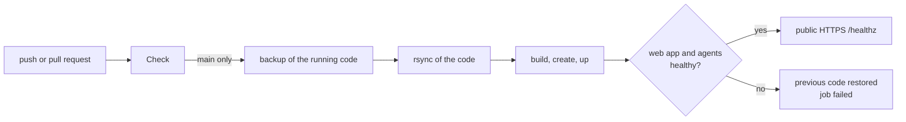

# Operations

## Deploy pipeline

`.github/workflows/ci-cd.yml` checks every push and pull request, and deploys `main` to the server.



**Check**, on every push and pull request: lint, type check, tests and build of `app/` (web app and agent; the page scripts run in Chrome on pages captured from Teams, the agent bundle runs as a process against a local Chrome); `node dist/agent.cjs --check`; deploy script syntax; both Compose files; Caddyfile; the image, whose build fails when the agent does not load in it.

**Deploy**, on every push to `main` or by hand (*Actions → CI/CD → Run workflow*):

1. `deploy/remote-deploy.sh backup` saves the running code.
2. `rsync --delete` uploads the code.
3. `remote-deploy.sh up` checks `.env` (session key), builds, creates every container including the stopped slots, starts web app, socket proxy and Caddy, and restarts Caddy when the Caddyfile changed.
4. The web app must answer, and every running agent must keep its restart count and write a health row younger than a minute (an agent with a wrong environment or VAPID key stops at start and restarts in a loop); otherwise the previous code comes back and the job fails.
5. `https://<DOMAIN>/healthz` is checked from the Internet.

One deploy at a time: close pushes queue up. The deploy never touches `.env`, `config/`, `data/` or `vapid/`. The agents run from the same image as the web app: a deploy that changes the image recreates them stopped, and the web app starts them again within seconds. The browsers (`chromium-N`) are recreated only when their configuration changes, so the Teams sessions survive deploys.

Secrets and variables of the repository (*Settings → Secrets and variables → Actions*):

| Name | Type | Content |
|---|---|---|
| `DEPLOY_HOST` | secret | IP or name of the server |
| `DEPLOY_USER` | secret | deploy user, member of the `docker` group |
| `DEPLOY_SSH_KEY` | secret | private SSH key dedicated to the deploy |
| `DEPLOY_KNOWN_HOSTS` | secret | output of `ssh-keyscan -t ed25519 <host>`: the host key is pinned |
| `DEPLOY_DOMAIN` | variable | public name, for the final check |

The server needs, once: the deploy user with the public key in `authorized_keys`, `/opt/teamsrelay` owned by it, `.env` and `vapid/` there ([setup.md](setup.md)). After the first deploy, only the Microsoft sign-in of each account is manual.

### Manual rollback

Run the workflow on an earlier commit (*Run workflow* after a `git revert` on `main`), or on the server:

```bash
cd /opt/teamsrelay
cat .deployed-sha                        # running version
tar -xzf /var/tmp/teamsrelay-prev.tgz    # code before the last deploy
COMPOSE_PROFILES=accounts docker compose build && COMPOSE_PROFILES=accounts docker compose create && docker compose up -d
```

A rollback to a release with the Python agent works on the same data: the tables and state keys of `data/N/messages.db` did not change with the TypeScript agent.

## Updates

Dependabot opens weekly pull requests for GitHub Actions, the images in `docker-compose.yml` (Chromium is pinned by digest), the Dockerfile and npm. Merging one deploys it. Keep the Chromium image current: it renders untrusted web content.

## Useful commands

```bash
cd /opt/teamsrelay
docker compose ps
docker compose logs -f webapp
docker compose --profile accounts logs -f agent-1     # NEWMSG, CMD and errors of slot 1
docker compose --profile accounts restart agent-1
```

### Agent log

One line per event, `<prefix>: <message> key=value`:

| Prefix | Event |
|---|---|
| `agent` | start with slot and push status, `check ok`, exit without a Teams tab, configuration error |
| `cdp` | connection to the browser, waiting for it, connection lost |
| `CMD` | a command of the web app starts (`id`, `arg`) |
| `NEWMSG`, `MSG` | new message from the chat list, notification caught from Teams |
| `SELFCHECK` | outcome of the automatic check |
| `show` | Teams goes back to the chat of the app or to the self chat |
| `page`, `input`, `presence` | page made visible, hook installed, input errors, your Teams status changed |
| `identity` | signed-in account found or changed |
| `open`, `send`, `reply`, `react`, `pill`, `edit`, `delete`, `readby` | an action that did not apply on Teams, and why |
| `chats`, `messages`, `activity`, `media`, `download`, `health` | reads that failed |
| `push`, `ntfy`, `appdb` | notification delivery and `app.db` errors |
| `job`, `loop`, `cmd` | a step or a command that threw, with its name |

## Troubleshooting

**Status red, "Session expired".** The most frequent case: conditional access invalidated the session, Teams shows *Chats are temporarily unavailable* or *We need you to sign in again* and stops syncing. Open the remote desktop (status panel → *Open the remote Teams*), sign in again with MFA; the status turns green within a minute. TeamsRelay sends a push when it happens.

**No notifications.** In the status panel:

- *Teams: Session expired*: sign in again.
- *Browser engine: Not responding*: `docker compose --profile accounts logs --tail 50 agent-N`, then restart `chromium-N` and `agent-N`.
- *New message detection: Stopped*: restart `agent-N`.
- *Push notifications: 0 devices*: enable notifications from the installed app.

Muted chats never notify, like in Teams. On iPhone the app must be opened from the Home Screen icon; check *Settings → Notifications → TeamsRelay* and the Focus modes. New VAPID keys require enabling notifications again on every device. **Recheck** in the status panel sends a test push.

**A reaction or an edit does not reach Teams.** The app says *not applied on Teams* when the agent does not see the change on the page within a few seconds. Usual causes: expired session, or someone using the remote desktop with a menu or a dialog open. The agent closes leftover menus before each action; the log lines start with `react:`, `pill:`, `edit:`, `reply:`, `delete:`.

**Chat list empty or old.** Pull to refresh, or **Resync**. A list stuck in the past is almost always an expired session. The agent rebuilds the full list every few minutes; restarts do not empty it.

**Teams reloaded by itself.** Teams web reloads now and then. The agent reconnects, reopens the chat in use, and restarts itself if the Teams tab stays invisible for 60 s.

**Web app does not start.** The log says why: `BETTER_AUTH_SECRET must be set` or `No users yet: set ADMIN_EMAIL and ADMIN_PASSWORD`.

**Adding or removing an account fails with "Wipe of slot N failed".** `docker logs teams-wipe-N` lists what could not be deleted. The container runs as `1000:1000`, the owner of the profile: a non-empty directory created as root inside `config/N/` (for example through `docker exec` as root) blocks it; give it back to `1000:1000` and try again.

## Backup

- `.env` (secrets), `vapid/` (push keys).
- `data/app.db` (users, slot ownership, devices).
- `config/` (Microsoft sessions of every account: **sensitive**, encrypt the backup).
- `data/N/` for each slot (messages, images, files): optional, the agent rebuilds the chat list from Teams.

## Uninstall

```bash
cd /opt/teamsrelay && docker compose --profile accounts down -v
sudo rm -rf /opt/teamsrelay
```
