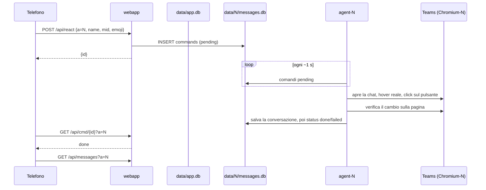

# Architettura

## Container

| Servizio | Immagine | Ruolo | Esposizione |
|---|---|---|---|
| `chromium-1`, `chromium-2`, `chromium-3`, `chromium-4` | `lscr.io/linuxserver/chromium` | Teams web dell'account N, sessione in `config/N/`, CDP su `127.0.0.1:9222` | nessuna: la porta 3000 (interfaccia del desktop) la raggiunge solo Caddy |
| `agent-1`, `agent-2`, `agent-3`, `agent-4` | `./agent` (Python, Playwright) | Legge e comanda Teams dell'account N, manda le push | nessuna; condivide la rete di `chromium-N` |
| `webapp` | `./webapp` (FastAPI) | PWA, API, gestisce account via dockerproxy | solo tramite Caddy |
| `dockerproxy` | `tecnativa/docker-socket-proxy` | Filtro Docker: la webapp può solo start/stop container esistenti | rete interna con webapp |
| `caddy` | `caddy:2` | HTTPS automatico, reverse proxy, `/api/authcheck` per il desktop | `80`, `${HTTPS_BIND}:${HTTPS_PORT}` |

I servizi `chromium-N` e `agent-N` sono nel profilo `accounts`: `docker compose up -d` non li avvia. `docker compose up -d --profile accounts` li attiva.

L'agent si collega a `http://127.0.0.1:9222`: Chromium espone CDP solo su IPv4, e `localhost` nel container risolve prima `::1`.

## Web app e agent

Web app e agent di un account non si parlano direttamente: condividono `data/N/messages.db` (SQLite in WAL). Un secondo database condiviso da tutti gli account, `data/app.db`, contiene l'elenco degli account e le sottoscrizioni push.



Lo stato della conversazione viene salvato **prima** di segnare il comando come concluso: quando la web app vede `done` e rilegge, trova già il nuovo stato.

Ogni account ha il suo agent che legge il proprio database: gli account girano in parallelo in piena indipendenza.

## Ciclo dell'agent

Un giro al secondo, circa:

| Quando | Cosa |
|---|---|
| ogni giro | hook delle notifiche di Teams (sorgente secondaria), comandi in coda, conversazione aperta |
| ogni ~3 giri | lista chat visibile: foto, anteprime, non letti, silenziate; rilevamento messaggi nuovi e push |
| ogni ~5 giri | stato di salute; se la sessione è scaduta, una sola push di avviso |
| ogni 2 giri, senza comandi | "Letto da" di un tuo messaggio recente nel gruppo aperto |
| ogni ~150 giri | feed Attività (passa alla vista Activity e torna alla chat) |
| ogni ~300 giri | lista chat completa, scorrendola dall'inizio alla fine |
| 8-11 e 17-20 | controllo automatico con push dell'esito |

Un messaggio è nuovo quando l'anteprima o l'orario di una chat cambia con un testo in arrivo, oppure quando la chat passa a non letta. Le chat silenziate e la chat con sé stessi non notificano; le notifiche uguali entro 150 s vengono scartate.

### Robustezza

- **Liste virtualizzate**: Teams disegna solo le voci che entrano nella finestra, e la finestra dipende da chi guarda il desktop remoto. Le letture parziali aggiornano la testa della lista senza cancellare il resto; la lettura completa scorre la lista e la riscrive in una sola transazione.
- **Reload di Teams**: se la pagina si ricarica l'agent chiude la vecchia connessione CDP e ne apre una nuova; senza chat aperta riapre quella in uso; se non vede la scheda per 60 s termina e Docker lo riavvia.
- **Chat giusta**: prima di salvare una conversazione l'agent controlla il titolo della chat aperta in Teams (`[data-tid="chat-title"]`), così un cambio di chat dal desktop non mescola i messaggi. L'invio rifiuta di scrivere se la chat aperta non è quella richiesta.

## Come vengono fatte le azioni

- **Barra azioni**: compare solo con un hover vero del mouse, gli eventi sintetici via JavaScript vengono ignorati. È disegnata in un portal fuori dal messaggio e possono esserne visibili due: si usa quella più vicina al messaggio e si clicca per coordinate.
- **Apertura di una chat**: click sulla riga. L'unico pulsante dentro la riga è *More chat options*, con voci come *Hide* e *Remove chat history*.
- **Reazioni**: pulsanti rapidi della barra, o il picker per 😢 e 😠. Togliere o aggiungere dalla pill sotto il messaggio è un click sulla pill (`aria-pressed` dice se è tua).
- **Rispondi**: *Reply with quote*, sulla barra per i messaggi altrui e nel menu *More options* per i tuoi. Dopo la citazione il cursore è già nel box: il testo si scrive senza cliccare e si invia con Invio.
- **Modifica**: editor in linea nel messaggio, pulsante *Done*. Se qualcosa va storto la bozza viene scartata (*Discard draft*), il messaggio resta com'era.
- **Elimina**: *More options → Delete*, immediato; *Undo* resta disponibile per poco.
- **Letto da**: voce *Read by X of Y* del menu *More options* e il suo sottomenu con i nomi.

## Contenuti

- **Testo**: il corpo del messaggio viene ricostruito dal DOM in HTML ridotto: solo tag noti, colori validati, link http(s), testo sempre escapato. Le emoji di Teams sono immagini con l'emoji nell'`alt`.
- **Immagini** dei messaggi: URL `blob:` o AMS leggibili solo nella pagina, scaricate con `fetch` dalla pagina in `data/media`. Le GIF di Giphy bloccano CORS e restano come URL pubblico.
- **Foto profilo**: l'API di Teams vuole il suo token e rifiuta `fetch`; le foto sono già disegnate nella pagina e sono dello stesso dominio, quindi vengono copiate da un canvas.
- **Allegati**: link SharePoint scaricati con la sessione del browser (`download=1`) in `data/files`, solo per `*.sharepoint.com`.

## Tabelle SQLite

Ogni account ha il suo `data/N/messages.db` con le tabelle qui sotto. Un database condiviso, `data/app.db`, contiene `accounts` e `push_subs`.

### `data/N/messages.db` (per account)

| Tabella | Contenuto |
|---|---|
| `chats` | lista chat: nome, anteprima, ora, non letto, menzione, silenziata, foto |
| `chat_messages` | messaggi delle chat aperte; i campi ricchi (HTML, immagini, file, reazioni, stato, letto da) stanno in `extra` come JSON |
| `readby` | "Letto da" per messaggio |
| `activity` | feed Attività |
| `commands` | coda dei comandi della web app con esito |
| `messages` | storico delle notifiche inviate |
| `state` | salute (teams, watcher, hook), chat attiva, identità (name, email, tenant, photo), risultati dei comandi |

### `data/app.db` (condiviso)

| Tabella | Contenuto |
|---|---|
| `accounts` | slot, timestamp di aggiunta |
| `push_subs` | endpoint, sottoscrizione Web Push per qualsiasi account |

## File del progetto

```
teamsrelay/
├── docker-compose.yml           stack di produzione
├── compose.local.yml            override per il PC (niente Caddy, niente login)
├── compose.local.env            variabili per lo sviluppo in locale
├── .env.example
├── agent/agent.py               lettura e pilotaggio di Teams, push, salute
├── webapp/app.py                API FastAPI, login, sessione, media e file
├── webapp/index.html            la PWA
├── webapp/static/               manifest, service worker, icone
├── caddy/Caddyfile              routing verso account N, HTTPS, authcheck
├── deploy/remote-deploy.sh      deploy e rollback sul server
├── .github/workflows/           CI/CD
├── docs/                        questa documentazione (VitePress)
└── tools/                       chiavi VAPID, icone
```

### Runtime (create a runtime, mai versionate)

```
teamsrelay/
├── config/1                      profilo del browser dell'account 1 (sessione Teams)
├── config/2, config/3, config/4  profili degli altri account
├── data/app.db                   elenco account, sottoscrizioni push (condiviso)
├── data/1/messages.db            chat e messaggi dell'account 1
├── data/1/media/                 immagini scaricate dall'account 1
├── data/1/files/                 file scaricati (SharePoint) dell'account 1
├── data/2/, data/3/, data/4/     dati degli altri account
├── vapid/private_key.pem         chiave privata VAPID (genera una volta)
├── vapid/appkey.txt              chiave pubblica VAPID
└── .caddyfile-sum                hash per rilevare cambiamenti del Caddyfile
```
